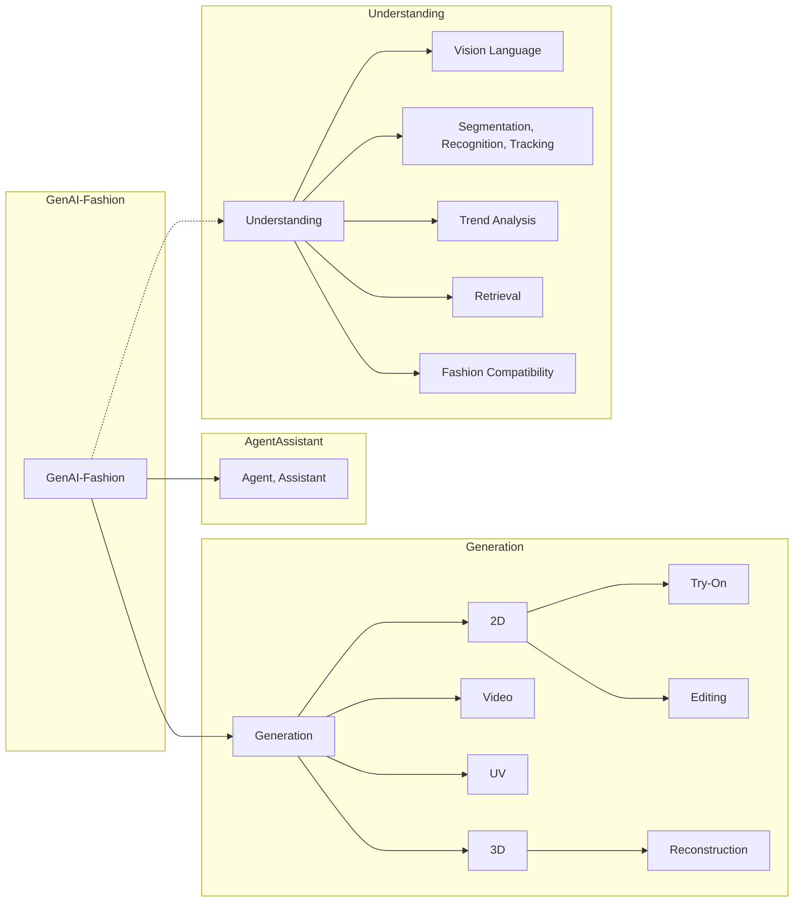

# 🕶️ Cool-GenAI-Fashion-Papers

🧢🕶️🥼👖👟🧳 A curated list of cool resources about GenAI-Fashion, including 📝papers, 👀workshops, 🚀companies & products, ...

All the GenAI-Fashion papers listed have been published since 2022.

For resources before 2022, please refer to [Other FashionAI Resources](#other-fashionai-resources).

Feel free to send a PR or open an issue.

## Table Of Content

- [📝Papers](#papers)

| Type | Category | Subcategory |
|----------|-------------|-----------------|
| [Understanding](#understanding) | [Vision Language](#vision-language) | - |
| [Understanding](#understanding) | [Segmentation, Recognition, Tracking](#segmentation-recognition-tracking) | - |
| [Understanding](#understanding) | [Trend Analysis](#trend-analysis) | - |
| [Understanding](#understanding) | [Retrieval](#retrieval) | - |
| [Understanding](#understanding) | [Fashion Compatibility](#fashion-compatibility) | - |
| [Generation](#generation)  | [2D](#2D)      | [Try-On](#try-on)      |
| [Generation](#generation)  | [2D](#2D)      | [Editing](#editing)      |
| [Generation](#generation) | [Video](#Video)  | - |
| [Generation](#generation) | [UV](#UV)  | - |
| [Generation](#generation) | [3D](#3D) | [Reconstruction](#reconstruction) |
| [Agent, Assistant](#agent-assistant) | - | - |

- [👀Workshops](#workshops)
- [🚀Companies, Products](#companies-products)
- [Researchers](#researchers)
- [Industry Reports](#industry-reports)
- [Other FashionAI Resources](#other-fashionai-resources)
- [Other GenAI Resources](#other-genai-resources)

## 📝Papers
### Generation
#### 2D

| Model | Title | Publication | Paper | Link | Region |
| ----- | ----- | ----------- | ----- | ---- | ------------ |
| ARMANI | ARMANI: Part-level Garment-Text Alignment for Unified Cross-Modal Fashion Design | MM 2022 | [paper](https://dl.acm.org/doi/10.1145/3503161.3548230) | - | China |
| AI Carpet | AI Carpet: Automatic Generation of Aesthetic Carpet Pattern | MM 2022 | [paper](https://dl.acm.org/doi/10.1145/3503161.3547734) | - | China |
| VolumeGAN | 3D-aware Image Synthesis via Learning Structural and Textural Representations | CVPR 2022 | -> | [project](https://genforce.github.io/volumegan/) | China |
| StyleMe | StyleMe: Towards Intelligent Fashion Generation with Designer Style | CHI 2023 | [paper](https://dl.acm.org/doi/fullHtml/10.1145/3544548.3581377) | [code](https://github.com/ExponentiAI/StyleMe) | China |
| generative.fashion | Fashioning the Future: Unlocking the Creative Potential of Deep Generative Models for Design Space Exploration | CHI EA 2023 | [paper](https://dl.acm.org/doi/abs/10.1145/3544549.3585644) | [project](https://generative.fashion/) | Switzerland |
| AI Archive | Generative AI for Concept Creation in Footwear Design | INVITED-TALK (SIGGRAPH 2023) | [paper](https://dl.acm.org/doi/10.1145/3587421.3595416) | - | Germany |
| UnitedHuman | UnitedHuman: Harnessing Multi-Source Data for High-Resolution Human Generation | ICCV 2023 | -> | [project](https://unitedhuman.github.io/) | China |
| FreeDoM | FreeDoM: Training-Free Energy-Guided Conditional Diffusion Model | ICCV 2023 | [paper](https://arxiv.org/abs/2303.09833) | [code](https://github.com/vvictoryuki/FreeDoM) | China |
| BoxDiff | BoxDiff: Text-to-Image Synthesis with Training-Free Box-Constrained Diffusion | ICCV 2023 | [paper](https://arxiv.org/abs/2307.10816) | [code](https://github.com/showlab/BoxDiff) | Singapore |
| ControlNet | Adding Conditional Control to Text-to-Image Diffusion Models | ICCV2023 | [paper](https://arxiv.org/abs/2302.05543) | [code](https://github.com/lllyasviel/ControlNet) | America |
| PromptStyler | PromptStyler: Prompt-driven Style Generation for Source-free Domain Generalization | ICCV 2023 | -> | [project](https://promptstyler.github.io/) | South Korea |
| VectorFusion | VectorFusion: Text-to-SVG by Abstracting Pixel-Based Diffusion Models | CVPR 2023 | -> | [project](https://ajayj.com/vectorfusion), [unofficial code](https://github.com/ximinng/VectorFusion-pytorch) | America |
| DiffSketcher | DiffSketcher: Text Guided Vector Sketch Synthesis through Latent Diffusion Models | NIPS 2023 | -> | [project](https://ximinng.github.io/DiffSketcher-project/) | China |
| SGDiff | SGDiff: A Style Guided Diffusion Model for Fashion Synthesis | MM 2023 | [paper](https://dl.acm.org/doi/10.1145/3581783.3613806) | [code](https://github.com/taited/SGDiff) | Hong Kong (China) |
| FashionDiff | FashionDiff: A Controllable Diffusion Model Using Pairwise Fashion Elements for Intelligent Design | MM 2023 | [paper](https://dl.acm.org/doi/10.1145/3581783.3612127) | - | China |
| InspirNET | InspirNET: An Unsupervised Generative Adversarial Network with Controllable Fine-grained Texture Disentanglement for Fashion Generation | MM 2023 | [paper](https://dl.acm.org/doi/10.1145/3581783.3612130) | - | China |
| - | Toward Intelligent Interactive Design: A Generation Framework Based on Cross-domain Fashion Elements | MM 2023 | [paper](https://dl.acm.org/doi/10.1145/3581783.3612376) | - | China |

##### Try-On
| Model | Title | Publication | Paper | Link |
| ----- | ----- | ----------- | ----- | ---- |
| - | A High-resolution Image-based Virtual Try-on System in Taobao E-commerce Scenario | MM 2022 | [paper](https://dl.acm.org/doi/10.1145/3503161.3547740) | - |
| GT-MUST | GT-MUST: Gated Try-on by Learning the Mannequin-Specific Transformation | MM 2022 | [paper](https://dl.acm.org/doi/10.1145/3503161.3547775) | - |
| PL-VTON | Progressive Limb-Aware Virtual Try-On | MM 2022 | [paper](https://dl.acm.org/doi/10.1145/3503161.3547999) | - |
| Flow-Style-VTON | Style-Based Global Appearance Flow for Virtual Try-On | CVPR 2022 | -> | [project](https://github.com/SenHe/Flow-Style-VTON/) |
| RT-VTON | Full-Range Virtual Try-On with Recurrent Tri-Level Transform | CVPR 2022 | -> | [project](https://lzqhardworker.github.io/RT-VTON/) |
| DGP | Weakly Supervised High-Fidelity Clothing Model Generation | CVPR 2022 | [paper](https://arxiv.org/abs/2112.07200) | - |
| FashionTex | FashionTex: Controllable Virtual Try-on with Text and Texture. | SIGGRAPH 2023 | [paper](https://arxiv.org/abs/2305.04451) | [code](https://github.com/picksh/FashionTex) | China |
|  SAL-VTON | Linking Garment with Person via Semantically Associated Landmarks for Virtual Try-On | CVPR 2023 | [paper](https://openaccess.thecvf.com/content/CVPR2023/papers/Yan_Linking_Garment_With_Person_via_Semantically_Associated_Landmarks_for_Virtual_CVPR_2023_paper.pdf) | [project](https://modelscope.cn/datasets/damo/SAL-HG/summary) |
| TryOnDiffusion | TryOnDiffusion: A Tale of Two UNets | CVPR 2023 | -> | [project](https://tryondiffusion.github.io/) |
| GP-VTON | GP-VTON: Towards General Purpose Virtual Try-on via Collaborative Local-Flow Global-Parsing Learning | CVPR 2023 | -> | [project](https://github.com/xiezhy6/GP-VTON) |
| LaDI-VTON | LaDI-VTON:Latent Diffusion Textual-Inversion Enhanced Virtual Try-On | MM 2023 | [paper](https://dl.acm.org/doi/10.1145/3581783.3612137) | [code](https://github.com/miccunifi/ladi-vton) |
| DCI-VTON | Taming the Power of Diffusion Models for High-Quality Virtual Try-On with Appearance Flow | MM 2023 | [paper](https://dl.acm.org/doi/10.1145/3581783.3612255) | [code](https://github.com/bcmi/DCI-VTON-Virtual-Try-On) |
| PG-VTON | PG-VTON: A Novel Image-Based Virtual Try-On Method via Progressive Inference Paradigm | TMM 2023 | [paper](https://arxiv.org/abs/2304.08956) | [code](https://github.com/NerdFNY/PGVTON) |
| DOC-VTON | OccluMix: Towards De-Occlusion Virtual Try-on by Semantically-Guided Mixup | TMM 2023 | [paper](https://arxiv.org/abs/2301.00965) | [code](https://github.com/JyChen9811/DOC-VTON) |
| StableVITON | StableVITON: Learning Semantic Correspondence with Latent Diffusion Model for Virtual Try-On | arXiv | -> | [project](https://rlawjdghek.github.io/StableVITON/) |

##### Editing
| Model | Title | Publication | Paper | Link |
| ----- | ----- | ----------- | ----- | ---- |
| SketchEdit | SketchEdit: Mask-Free Local Image Manipulation with Partial Sketches | CVPR 2022 | -> | [project](https://zengxianyu.github.io/sketchedit/) | China |
| Patternshop | Patternshop: Editing Point Patterns by Image Manipulation | SIGGRAPH 2023 | -> | [project](https://xchhuang.github.io/patternshop/index.html) | Germany |
| MGD | Multimodal Garment Designer: Human-Centric Latent Diffusion Models for Fashion Image Editing | ICCV 2023 | [paper](https://arxiv.org/abs/2304.02051) | [code](https://github.com/aimagelab/multimodal-garment-designer) | Italy |
| EditAnything | EditAnything: Empowering Unparalleled Flexibility in Image Editing and Generation | MM 2023 | [paper](https://dl.acm.org/doi/10.1145/3581783.3612680) | [project](https://github.com/sail-sg/EditAnything) | China |

#### Video
| Model | Title | Publication | Paper | Link |
| ----- | ----- | ----------- | ----- | ---- |
| wFlow | Dressing in the Wild by Watching Dance Videos | CVPR 2022 | -> | [project](https://awesome-wflow.github.io/) |
| ClothFormer | ClothFormer: Taming Video Virtual Try-on in All Module | CVPR 2022 | -> | [project](https://cloth-former.github.io/) |
| GPT4Motion | GPT4Motion: Scripting Physical Motions in Text-to-Video Generation via Blender-Oriented GPT Planning | arXiv | -> | [project](https://gpt4motion.github.io/) | China |
| Animate Anyone | Animate Anyone: Consistent and Controllable Image-to-Video Synthesis for Character Animation | arXiv | -> | [project](https://humanaigc.github.io/animate-anyone/) | China |

#### UV
| Model | Title | Publication | Paper | Link |
| ----- | ----- | ----------- | ----- | ---- |
| TemporalUV | TemporalUV: Capturing Loose Clothing with Temporally Coherent UV Coordinates | CVPR 2022 | [paper](https://arxiv.org/abs/2204.03671) | - |
| - | Normal-guided Garment UV Prediction for Human Re-texturing | CVPR 2023 | [paper](https://arxiv.org/abs/2303.06504) | - |

#### 3D
| Model | Title | Publication | Paper | Link |
| ----- | ----- | ----------- | ----- | ---- |
| ReFU | A Repulsive Force Unit for Garment Collision Handling in Neural Networks | ECCV 2022 | -> | [project](https://gamma.umd.edu/researchdirections/mlphysics/refu/) |
| SNUG | SNUG: Self-Supervised Neural Dynamic Garments | CVPR 2022 | -> | [project](https://mslab.es/projects/SNUG/) |
| ICON | ICON: Implicit Clothed humans Obtained from Normals | CVPR 2022 | -> | [project](https://github.com/YuliangXiu/ICON) |
| True Seams | True Seams:Modeling Seams in Digital Garments | SIGGRAPH 2022 | -> | [project](https://gabrielcirio.gitlab.io/projects/trueseams/trueseams.html) |
| VirtualBones | Predicting Loose-Fitting Garment Deformations Using Bone-Driven Motion Networks | SIGGRAPH 2022 | -> | [project](http://www.cad.zju.edu.cn/home/jin/SigCloth2022/SigCloth2022.htm) |
| HairStep | HairStep: Transfer Synthetic to Real Using Strand and Depth Maps for Single-View 3D Hair Modeling | CVPR 2023 | -> | [project](https://paulyzheng.github.io/research/hairstep/) |
| ECON | ECON: Explicit Clothed humans Optimized via Normal integration | CVPR 2023 | -> | [project](https://github.com/YuliangXiu/ECON) |
| DrapeNet | DrapeNet: Garment Generation and Self-Supervised Draping | CVPR 2023 | -> | [project](https://github.com/liren2515/DrapeNet) |
| AnchorDEF | Learning Anchor Transformations for 3D Garment Animation | CVPR 2023 | -> | [project](https://semanticdh.github.io/AnchorDEF/) |
| CloSET | CloSET: Modeling Clothed Humans on Continuous Surface with Explicit Template Decomposition | CVPR 2023 | -> | [project](https://www.liuyebin.com/closet/) |
| - | Clothed Human Performance Capture with a Double-layer Neural Radiance Fields | CVPR 2023 | [paper](https://openaccess.thecvf.com/content/CVPR2023/papers/Wang_Clothed_Human_Performance_Capture_With_a_Double-Layer_Neural_Radiance_Fields_CVPR_2023_paper.pdf) | - |
| HOOD | HOOD: Hierarchical Graphs for Generalized Modelling of Clothing Dynamics | CVPR 2023 | -> | [project](https://dolorousrtur.github.io/hood/) |
| xCloth | xCloth: Extracting Template-free Textured 3D Clothes from a Monocular Image | MM 2023 | [paper](https://dl.acm.org/doi/10.1145/3503161.3548419) | - |
| AvatarFusion | AvatarFusion: Zero-shot Generation of Clothing-Decoupled 3D Avatars Using 2D Diffusion | MM 2023 | [paper](https://dl.acm.org/doi/10.1145/3581783.3612022) | [project](https://hansenhuang0823.github.io/AvatarFusion/) |
| Control3D | Control3D: Towards Controllable Text-to-3D Generation | MM 2023 | [paper](https://dl.acm.org/doi/10.1145/3581783.3612489) | - |
| SynBody | SynBody: Synthetic Dataset with Layered Human Models for 3D Human Perception and Modeling | ICCV 2023 | -> | [project](https://synbody.github.io/) |
| EVA3D | EVA3D: Compositional 3D Human Generation from 2D Image Collections | ICLR 2023 | -> | [project](https://hongfz16.github.io/projects/EVA3D.html) |

##### Reconstruction
| Model | Title | Publication | Paper | Link |
| ----- | ----- | ----------- | ----- | ---- |
| CrossHuman | CrossHuman: Learning Cross-guidance from Multi-frame Images for Human Reconstruction | MM 2022 | [paper](https://dl.acm.org/doi/10.1145/3503161.3548351) | - |
| ReEF | Registering Explicit to Implicit: Towards High-Fidelity Garment mesh Reconstruction from Single Images | CVPR 2022 | -> | [project](https://kv2000.github.io/2022/03/28/reef/) |
| PHORHUM | Photorealistic Monocular 3D Reconstruction of Humans Wearing Clothing | CVPR 2022 | -> | [project](https://phorhum.github.io/) |
| NeuralTailor | NeuralTailor: Reconstructing Sewing Pattern Structures from 3D Point Clouds of Garments | SIGGRAPH 2022 | [paper](https://arxiv.org/abs/2201.13063) | - |
| SewFormer | Towards Garment Sewing Pattern Reconstruction from a Single Image | TOG (SIGGRAPH Asia 2023) | -> | [project](https://sewformer.github.io/) |
| GTA | Global-correlated 3D-decoupling Transformer for Clothed Avatar Reconstruction | NIPS 2023 | -> | [project](https://river-zhang.github.io/GTA-projectpage/) |
| SeSDF | SeSDF: Self-evolved Signed Distance Field for Implicit 3D Clothed Human Reconstruction | CVPR 2023 | [paper](https://openaccess.thecvf.com/content/CVPR2023/papers/Cao_SeSDF_Self-Evolved_Signed_Distance_Field_for_Implicit_3D_Clothed_Human_CVPR_2023_paper.pdf) | - |
| CAR | High-Fidelity Clothed Avatar Reconstruction from a Single Image | CVPR 2023 | -> | [project](https://github.com/TingtingLiao/CAR) |
| DIFu | DIFu: Depth-Guided Implicit Function for Clothed Human Reconstruction | CVPR 2023 | -> | [project](https://eadcat.github.io/DIFu/) |
| NeuralUDF | NeuralUDF: Learning Unsigned Distance Fields for Multi-view Reconstruction of Surfaces with Arbitrary Topologies | CVPR 2023 | -> | [project](https://www.xxlong.site/NeuralUDF/) |
| CLOTH4D | CLOTH4D: A Dataset for Clothed Human Reconstruction | CVPR 2023 | -> | [project](https://github.com/AemikaChow/CLOTH4D) |
| REC-MV | REC-MV: REconstructing 3D Dynamic Cloth from Monocular Videos | CVPR 2023 | -> | [project](https://lingtengqiu.github.io/2023/REC-MV/) |
| Get3DHuman | Get3DHuman: Lifting StyleGAN-Human into a 3D Generative Model using Pixel-aligned Reconstruction Priors |ICCV2023| -> |[project](https://x-zhangyang.github.io/2023_Get3DHuman/) |

### Agent, Assistant
| Model | Title | Publication | Paper | Link |
| ----- | ----- | ----------- | ----- | ---- |
| - | A Conversational Shopping Assistant for Online Virtual Stores | MM 2022 | [paper](https://dl.acm.org/doi/10.1145/3503161.3547738) | - |
| Fashion-GPT | Fashion-GPT: Integrating LLMs with Fashion Retrieval System | LGM3A '23 (MM 2023 workshop) | [paper](https://dl.acm.org/doi/10.1145/3607827.3616844) | - |
| FashionMatrix | Fashion Matrix: Editing Photos by Just Talking | arXiv | -> | [project](https://zheng-chong.github.io/FashionMatrix/) |

### Understanding
#### Vision Language
| Model | Title | Publication | Paper | Link |
| ----- | ----- | ----------- | ----- | ---- |
| FashionCLIP | Contrastive language and vision learning of general fashion concepts | Scientific Reports (2022) | [paper](https://www.nature.com/articles/s41598-022-23052-9) | [code](https://github.com/patrickjohncyh/fashion-clip) |
| GradREC | “Does it come in black?” CLIP-like models are zero-shot recommenders | ECNLP 5(ACL 2022 workshop) | [paper](https://aclanthology.org/2022.ecnlp-1.22/) | [code](https://github.com/patrickjohncyh/gradient-recs) |
| FashionViL | Fashion-Focused Vision-and-Language Representation Learning | ECCV 2022 | -> | [project](https://github.com/BrandonHanx/mmf) |
| FAME-ViL | FAME-ViL: Multi-Tasking Vision-Language Model for Heterogeneous Fashion Tasks | CVPR 2023 | -> | [project](https://github.com/BrandonHanx/FAME-ViL) |
| FashionSAP | FashionSAP: Symbols and Attributes Prompt for Fine-grained Fashion Vision-Language Pre-training | CVPR 2023 | -> | [project](https://github.com/hssip/FashionSAP) |

#### Segmentation, Recognition, Tracking
| Model | Title | Publication | Paper | Link |
| ----- | ----- | ----------- | ----- | ---- |
| Fashionformer | Fashionformer: A Simple, Effective and Unified Baseline for Human Fashion Segmentation and Recognition | ECCV 2022 | -> | [project](https://github.com/xushilin1/FashionFormer) |
| GarmentTracking | GarmentTracking: Category-Level Garment Pose Tracking  | CVPR 2023 | -> | [project](https://garment-tracking.robotflow.ai/) |

#### Trend Analysis
| Model | Title | Publication | Paper | Link |
| ----- | ----- | ----------- | ----- | ---- |
| POP | POP: Mining POtential Performance of new fashion products via webly cross-modal query expansion | ECCV 2022 | -> | [project](https://github.com/HumaticsLAB/POP-Mining-POtential-Performance) |

#### Retrieval
| Model | Title | Publication | Paper | Link |
| ----- | ----- | ----------- | ----- | ---- |
| MODC | Fine-grained Fashion Representation Learning by Online Deep Clustering| ECCV 2022 | [paper](https://www.ecva.net/papers/eccv_2022/papers_ECCV/papers/136870019.pdf) | - |
| FashionVLP | FashionVLP: Vision Language Transformer for Fashion Retrieval with Feedback | CVPR 2022 | [paper](https://openaccess.thecvf.com/content/CVPR2022/papers/Goenka_FashionVLP_Vision_Language_Transformer_for_Fashion_Retrieval_With_Feedback_CVPR_2022_paper.pdf) | - |
| EI-CLIP | EI-CLIP: Entity-aware Interventional Contrastive Learning for E-commerce Cross-modal Retrieval | CVPR 2022 | [paper](https://openaccess.thecvf.com/content/CVPR2022/papers/Ma_EI-CLIP_Entity-Aware_Interventional_Contrastive_Learning_for_E-Commerce_Cross-Modal_Retrieval_CVPR_2022_paper.pdf) | - |
| M3-Net | Learning Attribute and Class-Specific Representation Duet for Fine-grained Fashion Analysis | CVPR 2023 | [paper](https://openaccess.thecvf.com/content/CVPR2023/papers/Jiao_Learning_Attribute_and_Class-Specific_Representation_Duet_for_Fine-Grained_Fashion_Analysis_CVPR_2023_paper.pdf) | - |
| - | Dynamic Network for Language-based Fashion Retrieval | MMIR ’23 (MM 2023 workshop)  | [paper](https://dl.acm.org/doi/10.1145/3606040.3617438) | - |

#### Fashion Compatibility
| Model | Title | Publication | Paper | Link |
| ----- | ----- | ----------- | ----- | ---- |
| Aesthetic 100 (Evaluation Protocol) | How Good Is Aesthetic Ability of a Fashion Model? | CVPR 2022 | [paper](https://openaccess.thecvf.com/content/CVPR2022/papers/Zou_How_Good_Is_Aesthetic_Ability_of_a_Fashion_Model_CVPR_2022_paper.pdf) | [dataset](https://github.com/AemikaChow/AiDLab-fAshIon-Data) |
| BiHGH | Bi-directional Heterogeneous Graph Hashing towards Efficient Outfit Recommendation | MM 2022 | [paper](https://dl.acm.org/doi/10.1145/3503161.3548020) | - |
| CP-TransMatch | Modeling Multi-Relational Connectivity for Personalized Fashion Matching | MM 2023 | [paper](https://dl.acm.org/doi/10.1145/3581783.3612583) | - |
| FCBoost-Net | FCBoost-Net: A Generative Network for Synthesizing Multiple Collocated Outfits via Fashion Compatibility Boosting | MM 2023 | [paper](https://dl.acm.org/doi/10.1145/3581783.3612036) | - |

## 👀Workshops
1. Workshop on Computer Vision for Fashion, Art, and Design (CVPR Workshop): [CVFAD 2023](https://sites.google.com/view/cvfad2023/home), [CVFAD 2022](https://sites.google.com/view/cvfad2022/home)
2. Workshop on Multimedia Computing towards Fashion Recommendation (ACM MM Workshop): [MCFR 2022](https://dl.acm.org/doi/abs/10.1145/3503161.3554765)
3. Machine Learning for Creativity and Design (NeurIPS Workshop): [ML4CD 2023](https://neuripscreativityworkshop.github.io/2023/), [ML4CD 2022](https://neuripscreativityworkshop.github.io/2022/)
4. Creative AI Across Modalities (AAAI Workshop): [creativeAI 2023](https://creativeai-ws.github.io/#cfp)

## 🚀Companies, Products
| Name                                                         | Found | Info                                        | News                                                         |
| ------------------------------------------------------------ | ----- | ------------------------------------------- | ------------------------------------------------------------ |
| [CALA](https://ca.la/) | 2016 | fashion supply chain interface that unifies design, development, production, and logistics | [2022.11](https://mp.weixin.qq.com/s/INLwwAqkHzQ2iLq-Oj7ZjA) |
| [Zalando Research](https://research.zalando.com/)            | 2016  | Research                                    | [2023.04 fashion assistant powered by ChatGPT](https://corporate.zalando.com/en/technology/zalando-launch-fashion-assistant-powered-chatgpt) |
| [Vue.ai](https://vue.ai/) | 2016 | Retail AI analysis, AI avatar | - |
| [极睿 infimind](http://infimind.com/)| 2017  | Fashion Product Content           | [2023.11 interview in mandarin](https://www.bilibili.com/video/BV1iu4y1879i/?spm_id_from=333.337.search-card.all.click&vd_source=32f6f61e74ca115cbaca6bd6bb144662)  |
| [知衣 zhiyi](https://www.zhiyitech.cn/)| 2018  | Fashion Design Collaboration, AIGC collaborate with [西湖辰心Scietrain](https://xinchenai.com/)          | [2023.08 Fashion Diffusion](https://mp.weixin.qq.com/s/TnYEc0bl0IasEdHsYmACOA) |
| [LALALAND](https://lalaland.ai/) | 2019 | AI avatar, Fashion Product Content | [2023.08 collaborate with Browzwear-VStitcher](https://mp.weixin.qq.com/s/ZPGR9UhlcaGIeRFUhiG4fA) |
| [PatternedAi](https://www.patterned.ai/) | 2021 | Pattern Design | - |
| [Dsign.Ai](https://app.dsign.ai/) | - | Prints and Patterns Design | - |
| [AIMDE-Symmpix](https://aimde.design/en) | 2023 | Fashion Pattern, 3D | [2023.11 new feature](https://mp.weixin.qq.com/s/priz3aVNByLW40hk2AdxSA) |
| [Weshop](https://www.weshop.com/) | 2023 | AI avatar & Fashion Product Content | a subsidiary of [MOGU](https://www.mogu.com/)  |
| [Wondershare VirtuLook](https://virtulook.wondershare.com/) | 2023 | AI avatar & Fashion Product Content | a subsidiary of [wondershare](https://www.wondershare.com/)|
| [Pixelcut](https://www.pixelcut.ai/) | 2022 | AI-powered editing tools(Product Content) | - |
| [CreatorKit](https://creatorkit.com/) | 2020 | AI Product Content, Videos | - |
| [DeepImage](https://deep-image.ai/) | 2022 | AI Product Content | - |
| [Unbound](https://www.unboundml.com/) | - | personal AI business assistant | - |
| [Zeg AI](https://www.zeg.ai/)| 2018 | AI Product Content, Videos, 3D Render | - |
| - | - | - | - |

## Researchers

| Group/Lab/Univ                                              |Researchers |
| ------------------------------------------------------------| -----------|
| [GAP Lab-CUHKSZ](https://gaplab.cuhk.edu.cn/pages/publications) | [Xiaoguang Han](https://scholar.google.com/citations?user=z-rqsR4AAAAJ&hl=en)|
| [HCP-I2 Lab-SYSU](https://www.sysu-hcp.net/publications/index.html) | [Xiaodan Liang](https://scholar.google.com/citations?user=voxznZAAAAAJ&hl=en),[Zhenyu Xie](https://xiezhy6.github.io/)|
| HIT SZ|[Haijun Zhang](https://dl2link.com/#)|
| [AiDlab-PolyU+RCA](https://www.aidlab.hk/en/)|[Calvin WONG](https://research.polyu.edu.hk/en/persons/wai-keung-wong-2),[Xingxing Zou](https://scholar.google.com/citations?user=UhnQA3UAAAAJ&hl=zh-CN),[P.Y.Mok](https://scholar.google.com.hk/citations?user=-83FFXcAAAAJ&hl=en)|
| [MMLab-NTU](https://www.mmlab-ntu.com/index.html)|[Ziwei Liu](https://liuziwei7.github.io/index.html)|
| UIUC | [Ranjitha Kumar](http://ranjithakumar.net/)|
| [AImageLab](https://aimagelab.ing.unimore.it/imagelab/)|[Rita Cucchiara](https://scholar.google.com/citations?user=OM3sZEoAAAAJ&hl=en)|
| The University of Utah|[Ziad Al-Halah](https://users.cs.utah.edu/~ziad/)|
| Georgia Tech|[Devi Parikh](https://faculty.cc.gatech.edu/~parikh/)|
| UT Austin|[Kristen Grauman](https://www.cs.utexas.edu/users/grauman/)|
| Cornell|[Kavita Bala](https://www.cs.cornell.edu/~kb/)|

## Industry Reports
| Reports                                              |Organization | Time |
| ------------------------------------------------------------| -----------| -----------|
| [Generative AI’s Act Two](https://www.sequoiacap.com/article/generative-ai-act-two/) | SEQUOIA | 2023.09 |
| [How Are Consumers Using Generative AI?](https://a16z.com/how-are-consumers-using-generative-ai/)| A16Z | 2023.09 |
| [Outlook for the Global and Chinese Fashion Industry in 2035](https://www.rolandberger.com/zh/Insights/Publications/2035%E5%85%A8%E7%90%83%E5%8F%8A%E4%B8%AD%E5%9B%BD%E6%97%B6%E5%B0%9A%E4%BA%A7%E4%B8%9A%E5%B1%95%E6%9C%9B.html)|Roland Berger|2023.08|
| [The Complete Playbook for Generative AI in Fashion](https://www.businessoffashion.com/case-studies/technology/generative-ai-playbook-machine-learning-emerging-technology/)|Bof|2023.06|
| [Generative AI: Unlocking the future of fashion](https://www.mckinsey.com/industries/retail/our-insights/generative-ai-unlocking-the-future-of-fashion) |McKinsey|2023.03|

## Other FashionAI Resources
1. [Fashion Datasets](https://github.com/AemikaChow/DATASOURCE)
2. [Cool Fashion Papers(Before 2022)](https://github.com/lzhbrian/Cool-Fashion-Papers)
3. [awesome-fashion-ai](https://github.com/ayushidalmia/awesome-fashion-ai)
4. [AI4Design Survey](https://idvxlab.com/ai4design/#)
5. [image-to-image-papers](https://github.com/lzhbrian/image-to-image-papers)
6. [Awesome Virtual Try-on (VTON) Research](https://github.com/minar09/awesome-virtual-try-on#non-clothing-virtual-try-on)
7. [Awesome-pose-transfer](https://github.com/Zhangjinso/Awesome-pose-transfer)
8. [Human Body Reconstruction](https://github.com/chenweikai/Body_Reconstruction_References)

## Other GenAI Resources
1. [The Roadmap of Generative AI](https://github.com/SeedV/generative-ai-roadmap)
2. [awesome-Ai-tools](https://github.com/TRA-Tech/awesome-artificial-intelligence-tools)
3. [LLM Survey](https://github.com/RUCAIBox/LLMSurvey)
4. [LLM-Agent-Paper-List](https://github.com/WooooDyy/LLM-Agent-Paper-List)
5. [Awesome-diffusion-model-for-image-processing](https://github.com/lixinustc/Awesome-diffusion-model-for-image-processing/tree/main)
6. [Multimodal Image Synthesis and Editing: The Generative AI Era](https://github.com/fnzhan/Generative-AI)
7. [GAN-Inversion Survey](https://github.com/weihaox/GAN-Inversion#gan-inversion-a-survey)
8. [A Survey on Deep Generative 3D-aware Image Synthesis](https://weihaox.github.io/3D-aware-Gen/)
9. [Awesome 3D Generation](https://github.com/justimyhxu/awesome-3D-generation)
10. [Generative AI meets 3D: A Survey on Text-to-3D in AIGC Era](https://arxiv.org/abs/2305.06131)
11. [Awesome GenAI Tech](https://github.com/hollobit/Awesome-GenAITech)
