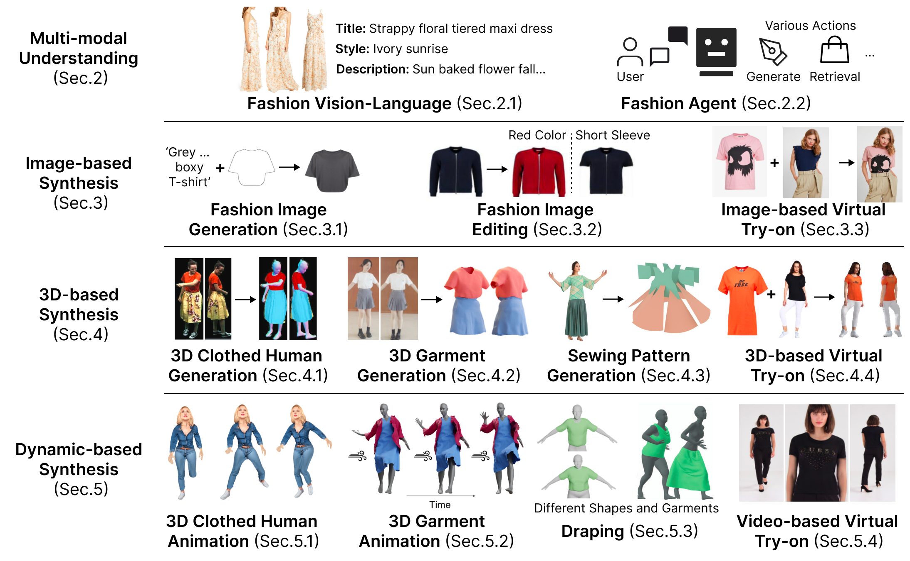
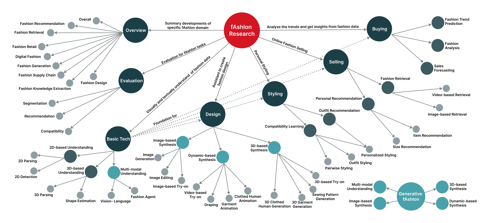

# 🕶️ Cool-GenAI-Fashion-Papers

[](https://awesome.re) [](https://GitHub.com/Naereen/StrapDown.js/graphs/commit-activity) [](http://makeapullrequest.com) 
  

This repo collected the latest fashion-related papers on top AI conferences (in [🔥Latest](#latest-fashion-related-papers) section). 
- Please feel free to send a PR or open an issue 😊.


<details>
  <summary>Change Log</summary>
 
  - 2025-08, Fashion-related papers in SIGGRAPH Asia 2025 are updated.
 
  - 2025-07, Fashion-related papers in ICCV 2025 are updated.
 
  - 2025-06, Fashion-centric metrics are involved, Fashion-related papers in SIGGRAPH 2025 are updated.
 
  - 2025-03, Fashion-related papers in CVPR 2025/ICLR 2025 are updated.

  - 2025-02, 'GenAI in Fashion: Overview' is accepted by ACM TIST(JCR Q1).
</details>

## Overview
This is also the official repo of [Generative AI in Fashion: Overview (ACM TIST 2025)](https://dl.acm.org/doi/10.1145/3718098) ⬅️
- The public datasets and benchmarks for each subtask are summarized in the corresponding section of paper.




## Table Of Content

- [🔥Latest](#latest-fashion-related-papers)
- [⚙️Metrics](#metrics)
- [📝Papers](#papers)
- [👀Workshops](#workshops)
- [🚀Companies, Products](#companies-products)
- [🧑‍🏫Researchers](#researchers)

## 🔥Latest Fashion-Related Papers

<details>
  <summary>SIGGRAPH Asia 2025-Fashion-Related-Papers</summary>
  <table>
    <thead>
      <tr>
        <th>No</th>
        <th>Title</th>
        <th>Authors</th>
        <th>Key words</th>
      </tr>
    </thead>
    <tbody>
      <tr>
        <td>1</td>
        <td>[GarmageNet: A Multimodal Generative Framework for Sewing Pattern Design and Generic Garment Modeling](https://github.com/Style3D/garmagenet-impl)</td>
        <td>Siran Li,  Chen Liu,  Ruiyang Liu,  Zhendong Wang,  Gaofeng He,  Yong-Lu Li,  Xiaogang Jin,  Huamin Wang</td>
        <td>sewing</td>
      </tr>
      <tr>
        <td>2</td>
        <td>[DreamO: A Unified Framework for Image Customization](https://github.com/bytedance/DreamO)</td>
        <td>Chong Mou, Yanze Wu, Wenxu Wu, Zinan Guo, Pengze Zhang, Yufeng Cheng, Yiming Luo, Fei Ding, Shiwen Zhang, Xinghui Li, Mengtian Li, Mingcong Liu, Yi Zhang, Shaojin Wu, Songtao Zhao, Jian Zhang, Qian He, Xinglong Wu</td>
        <td>try-on</td>
      </tr>
      <tr>
        <td>3</td>
        <td>[One-shot Embroidery Customization via Contrastive LoRA Modulation](https://style3d.github.io/embroidery_customization/)</td>
        <td>Jun Ma, Qian He, Gaofeng He, Huang Chen, Chen Liu, Xiaogang Jin, Huamin Wang</td>
        <td>stylization, embroidery</td>
      </tr>
    </tbody>
  </table>
</details>


<details>
  <summary>ICCV 2025-Fashion-Related-Papers</summary>
  <table>
    <thead>
      <tr>
        <th>No</th>
        <th>Title</th>
        <th>Authors</th>
        <th>Key words</th>
      </tr>
    </thead>
    <tbody>
      <tr>
        <td>1</td>
        <td>[CSD-VAR: Content-Style Decomposition in Visual Autoregressive Models](https://arxiv.org/abs/2507.13984)</td>
        <td>Quang-Binh Nguyen · Minh Luu · Quang Nguyen · Anh Tran · Khoi Nguyen</td>
        <td>style</td>
      </tr>
      <tr>
        <td>2</td>
        <td>Wasserstein Style Distribution Analysis and Transform for Stylized Image Generation</td>
        <td>Xi Yu · Xiang Gu · Zhihao Shi · Jian Sun</td>
        <td>style</td>
      </tr>
      <tr>
        <td>3</td>
        <td>RAGDiffusion: Faithful Cloth Generation via External Knowledge Assimilation</td>
        <td>Yuhan Li · Xianfeng Tan · Wenxiang Shang · Yubo Wu · Jian Wang · Xuanhong Chen · Yi Zhang · Zhu Hangcheng · Bingbing Ni</td>
        <td>cloth</td>
      </tr>
      <tr>
        <td>4</td>
        <td>From Imitation to Innovation: The Emergence of AI's Unique Artistic Styles and the Challenge of Copyright Protection</td>
        <td>Zexi Jia · Chuanwei Huang · Hongyan Fei · Yeshuang Zhu · Zhiqiang Yuan · Ying Deng · Jiapei Zhang · Jinchao Zhang · Jie Zhou</td>
        <td>style</td>
      </tr>
      <tr>
        <td>5</td>
        <td>Split-and-Combine: Enhancing Style Augmentation for Single Domain Generalization</td>
        <td>Lichuan Gu · Shuai Yang · Qianlong Dang · Zhize Wu · LiChuan Gu</td>
        <td>style</td>
      </tr>
      <tr>
        <td>6</td>
        <td>[FonTS: Text Rendering With Typography and Style Controls](https://wendashi.github.io/FonTS-Page/)</td>
        <td>Wenda SHI · Yiren Song · Dengming Zhang · Jiaming Liu · XINGXING ZOU</td>
        <td>style</td>
      </tr>
      <tr>
        <td>7</td>
        <td>ConstStyle: Robust Domain Generalization with Unified Style Transformation</td>
        <td>Nam Duong Tran · Nam Nguyen Phuong · Hieu Pham · Phi Le Nguyen · My Thai</td>
        <td>style</td>
      </tr>
      <tr>
        <td>8</td>
        <td>A$^3$GS: Arbitrary Artistic Style into Arbitrary 3D Gaussian Splatting</td>
        <td>Zhiyuan Fang · Rengan Xie · Xuancheng Jin · Qi Ye · Wei Chen · Wenting Zheng · Rui Wang · Yuchi Huo</td>
        <td>style</td>
      </tr>
      <tr>
        <td>9</td>
        <td>HiGarment: Cross-modal Harmony Based Diffusion Model for Flat Sketch to Realistic Garment Image</td>
        <td>Junyi Guo · Jingxuan Zhang · Fangyu Wu · Huanda Lu · Qiufeng Wang · Wenmian Yang · ENG LIM · Dongming Lu</td>
        <td>garment</td>
      </tr>
      <tr>
        <td>10</td>
        <td>WikiAutoGen: Towards Multi-Modal Wikipedia-Style Article Generation</td>
        <td>Zhongyu Yang · Jun Chen · Dannong Xu · Junjie Fei · Xiaoqian Shen · Liangbing Zhao · Chun-Mei Feng · Mohamed Elhoseiny</td>
        <td>style</td>
      </tr>
      <tr>
        <td>11</td>
        <td>Balanced Image Stylization with Style Matching Score</td>
        <td>Yuxin Jiang · Liming Jiang · Shuai Yang · Jia-Wei Liu · Ivor Tsang · Mike Zheng Shou</td>
        <td>style</td>
      </tr>
      <tr>
        <td>12</td>
        <td>NGD: Neural Gradient Based Deformation for Monocular Garment Reconstruction</td>
        <td>Soham Dasgupta · Shanthika Naik · Preet Savalia · Sujay Kumar Ingle · Avinash Sharma</td>
        <td>garment</td>
      </tr>
      <tr>
        <td>13</td>
        <td>SCFlow: Implicitly Learning Style and Content Disentanglement with Flow Models</td>
        <td>Pingchuan Ma · Xiaopei Yang · Ming Gui · Yusong Li · Felix Krause · Johannes Schusterbauer · Björn Ommer</td>
        <td>style</td>
      </tr>
      <tr>
        <td>14</td>
        <td>AIComposer: Any Style and Content Image Composition via Feature Integration</td>
        <td>Haowen Li · Zhenfeng Fan · Zhang Wen · Zhengzhou Zhu · Yunjin Li</td>
        <td>style</td>
      </tr>
      <tr>
        <td>15</td>
        <td>StyleMotif: Multi-Modal Motion Stylization using Style-Content Cross Fusion</td>
        <td>Ziyu Guo · Young-Yoon Lee · Joseph Liu · Yizhak Ben-Shabat · Victor Zordan · Mubbasir Kapadia</td>
        <td>style</td>
      </tr>
      <tr>
        <td>16</td>
        <td>[LOTS of Fashion! Multi-Conditioning for Image Generation via Sketch-Text Pairing](https://intelligolabs.github.io/lots/)</td>
        <td>Federico Girella · Davide Talon · Ziyue Liu · Zanxi Ruan · Yiming Wang · Marco Cristani</td>
        <td>fashion</td>
      </tr>
      <tr>
        <td>17</td>
        <td>Multimodal Latent Diffusion Model for Complex Sewing Pattern Generation</td>
        <td>Shengqi Liu · Yuhao Cheng · Zhuo Chen · Xingyu Ren · Wenhan Zhu · Lincheng Li · Mengxiao Bi · Xiaokang Yang · Yichao Yan</td>
        <td>sewing</td>
      </tr>
      <tr>
        <td>18</td>
        <td>Rethinking DPO-style Diffusion Aligning Frameworks</td>
        <td>XUN WU · Shaohan Huang · Lingjie Jiang · Furu Wei</td>
        <td>style</td>
      </tr>
      <tr>
        <td>19</td>
        <td>Text2Outfit: Controllable Outfit Generation with Multimodal Language Models</td>
        <td>Yuanhao Zhai · Yen-Liang Lin · Minxu Peng · Larry Davis · Ashwin Chandramouli · Junsong Yuan · David Doermann</td>
        <td>outfit</td>
      </tr>
      <tr>
        <td>20</td>
        <td>LoRA.rar: Learning to Merge LoRAs via Hypernetworks for Subject-Style Conditioned Image Generation</td>
        <td>Donald Shenaj · Ondrej Bohdal · Mete Ozay · Pietro Zanuttigh · Umberto Michieli</td>
        <td>style</td>
      </tr>
      <tr>
        <td>21</td>
        <td>UnZipLoRA: Separating Content and Style from a Single Image</td>
        <td>Chang Liu · Viraj Shah · Aiyu Cui · Svetlana Lazebnik</td>
        <td>style</td>
      </tr>
      <tr>
        <td>22</td>
        <td>Cross-Category Subjectivity Generalization for Style-Adaptive Sketch Re-ID</td>
        <td>Zechao Hu · Zhengwei Yang · Hao Li · Yixiong Zou · Zheng Wang</td>
        <td>style</td>
      </tr>
      <tr>
        <td>23</td>
        <td>StyleSRN: Scene Text Image Super-Resolution with Text Style Embedding</td>
        <td>Shengrong Yuan · Runmin Wang · Ke Hao · Xu-Qi Ma · Changxin Gao · Li Liu · Nong Sang</td>
        <td>style</td>
      </tr>
      <tr>
        <td>24</td>
        <td>Pose-Star: Anatomy-Aware Editing for Open-World Fashion Images</td>
        <td>Yuran Dong · Mang Ye</td>
        <td>fashion</td>
      </tr>
      <tr>
        <td>25</td>
        <td>Any2AnyTryon: Leveraging Adaptive Position Embeddings for Versatile Virtual Clothing Tasks</td>
        <td>Hailong Guo · Bohan Zeng · Yiren Song · Wentao Zhang · Jiaming Liu · Chuang Zhang</td>
        <td>clothing</td>
      </tr>
      <tr>
        <td>26</td>
        <td>SA-LUT: Spatial Adaptive 4D Look-Up Table for Photorealistic Style Transfer</td>
        <td>Zerui Gong · Zhonghua Wu · Qingyi Tao · Qinyue Li · Chen Change Loy</td>
        <td>style</td>
      </tr>
      <tr>
        <td>27</td>
        <td>DuoLoRA : Cycle-consistent and Rank-disentangled Content-Style Personalization</td>
        <td>Aniket Roy · Shubhankar Borse · Shreya Kadambi · Debasmit Das · Shweta Mahajan · Risheek Garrepalli · Hyojin Park · Ankita Nayak · Rama Chellappa · Munawar Hayat · Fatih Porikli</td>
        <td>style</td>
      </tr>
      <tr>
        <td>28</td>
        <td>All Parts Matter: A Unified Mask-Free Virtual Try-On Framework</td>
        <td>Chenghu Du · Shengwu Xiong · Yi Rong</td>
        <td>try-on</td>
      </tr>
      <tr>
        <td>29</td>
        <td>Magic Insert: Style-Aware Drag-and-Drop</td>
        <td>Nataniel Ruiz · Yuanzhen Li · Neal Wadhwa · Yael Pritch · Michael Rubinstein · David Jacobs · Shlomi Fruchter</td>
        <td>style</td>
      </tr>
      <tr>
        <td>30</td>
        <td>MSA$^2$: Multi-task Framework with Structure-aware and Style-adaptive Character Representation for Open-set Chinese Text Recognition</td>
        <td>Yangfu Li · Hongjian Zhan · Qi Liu · Li Sun · Yu-Jie Xiong · Yue Lu</td>
        <td>style</td>
      </tr>
      <tr>
        <td>31</td>
        <td>OmniVTON: Training-Free Universal Virtual Try-On</td>
        <td>Zhaotong Yang · Yuhui Li · Shengfeng He · Xinzhe Li · Yangyang Xu · Junyu Dong · Yong Du</td>
        <td>try-on</td>
      </tr>
      <tr>
        <td>32</td>
        <td>PromptDresser: Improving the Quality and Controllability of Virtual Try-On via Generative Textual Prompt and Prompt-aware Mask</td>
        <td>Jeongho Kim · Hoiyeong Jin · Sunghyun Park · Jaegul Choo</td>
        <td>try-on</td>
      </tr>
      <tr>
        <td>33</td>
        <td>Learning Implicit Features with Flow-Infused Transformations for Realistic Virtual Try-On</td>
        <td>Delong Zhang · Qiwei Huang · Yang Sun · Yuanliu Liu · Wei-Shi Zheng · Pengfei Xiong · Wei Zhang</td>
        <td>try-on</td>
      </tr>
      <tr>
        <td>34</td>
        <td>IntroStyle: Training-Free Introspective Style Attribution using Diffusion Features</td>
        <td>Anand Kumar · Jiteng Mu · Nuno Vasconcelos</td>
        <td>style</td>
      </tr>
      <tr>
        <td>35</td>
        <td>MEH: A Multi-Style Dataset and Toolkit for Advancing Egyptian Hieroglyph Recognition</td>
        <td>Maksim Golyadkin · Rubanova Alexandrovna · Aleksandr Utkov · Dmitry Nikolotov · Ilya Makarov</td>
        <td>style</td>
      </tr>
      <tr>
        <td>36</td>
        <td>Domain Generalizable Portrait Style Transfer</td>
        <td>Xinbo Wang · Wenju Xu · Qing Zhang · Wei-Shi Zheng</td>
        <td>style</td>
      </tr>
      <tr>
        <td>37</td>
        <td>TextMaster: A Unified Framework for Realistic Text Editing via Glyph-Style Dual-Control</td>
        <td>Zhenyu Yan · Jian Wang · Aoqiang Wang · Yuhan Li · Wenxiang Shang · Zhu Hangcheng</td>
        <td>style</td>
      </tr>
      <tr>
        <td>38</td>
        <td>Tune-Your-Style: Intensity-tunable 3D Style Transfer with Gaussian Splatting</td>
        <td>Yian Zhao · rushi ye · Ruochong Zheng · Zesen Cheng · Chaoran Feng · Jiashu Yang · Pengchong Qiao · Chang Liu · Jie Chen</td>
        <td>style</td>
      </tr>
    </tbody>
  </table>
</details>

<details>
  <summary>SIGGRAPH 2025-Fashion-Related-Papers</summary>
  <table>
    <thead>
      <tr>
        <th>No</th>
        <th>Title</th>
        <th>Authors</th>
        <th>Key words</th>
      </tr>
    </thead>
    <tbody>
      <tr>
        <td>1</td>
        <td>[Single View Garment Reconstruction Using Diffusion Mapping Via Pattern Coordinates](https://liren2515.github.io/page/dmap/dmap.html)</td>
        <td>Ren Li, Cong Cao, Corentin Dumery, Yingxuan You, Hao Li, Pascal Fua</td>
        <td>Garment Reconstruction</td>
      </tr>
      <tr>
        <td>2</td>
        <td>[Rags2Riches: Computational Garment Reuse](https://anranqi.github.io/Rags2riches.github.io/)</td>
        <td>Anran Qi, Nico Pietroni, Maria Korosteleva, Olga Sorkine-Hornung, Adrien Bousseau</td>
        <td>Sewing Pattern Transfer</td>
      </tr>
       <tr>
        <td>3</td>
        <td>[GarmentImage: Raster Encoding of Garment Sewing Patterns with Diverse Topologies](https://yukistavailable.github.io/garmentimage.github.io/)</td>
        <td>Yuki Tatsukawa, Anran Qi, I-Chao Shen, Takeo Igarashi</td>
        <td>Garment Reconstruction</td>
      </tr>
      <tr>
        <td>4</td>
        <td>[Dress-1-to-3: Single Image to Simulation-Ready 3D Outfit with Diffusion Prior and Differentiable Physics](https://dress-1-to-3.github.io/)</td>
        <td>Xuan Li, Chang Yu, Wenxin Du, Ying Jiang, Tianyi Xie, Yunuo Chen, Yin Yang, Chenfanfu Jiang</td>
        <td>Garment Reconstruction</td>
      </tr>
      <tr>
        <td>5</td>
        <td>[3D Stylization via Large Reconstruction Model](https://arxiv.org/abs/2504.21836)</td>
        <td>Ipek Oztas, Duygu Ceylan, Aysegul Dundar</td>
        <td>Style</td>
      </tr>
    </tbody>
  </table>
</details>


<details>
  <summary>CVPR 2025-Fashion-Related-Papers</summary>
  <table>
    <thead>
      <tr>
        <th>No</th>
        <th>Title</th>
        <th>Authors</th>
        <th>Key words</th>
      </tr>
    </thead>
    <tbody>
      <tr>
        <td>1</td>
        <td>Text-Driven Fashion Image Editing with Compositional Concept Learning and Counterfactual Abduction</td>
        <td>Shanshan Huang · Haoxuan Li · Chunyuan Zheng · Mingyuan Ge · WeiGao · Lei Wang · Li Liu</td>
        <td>fashion</td>
      </tr>
      <tr>
        <td>2</td>
        <td>DKC: Differentiated Knowledge Consolidation for Cloth-Hybrid Lifelong Person Re-identification</td>
        <td>Zhenyu Cui · Jiahuan Zhou · Yuxin Peng</td>
        <td>cloth</td>
      </tr>
      <tr>
        <td>3</td>
        <td>Identity-Clothing Similarity Modeling for Unsupervised Clothing Change Person Re-Identification</td>
        <td>Zhiqi Pang · Junjie Wang · Lingling Zhao · Chunyu Wang</td>
        <td>clothing</td>
      </tr>
      <tr>
        <td>4</td>
        <td>K-LoRA: Unlocking Training-Free Fusion of Any Subject and Style LoRAs</td>
        <td>Ziheng Ouyang · Zhen Li · Qibin Hou</td>
        <td>style</td>
      </tr>
      <tr>
        <td>5</td>
        <td>Style Evolving along Chain-of-Thought for Unknown-Domain Object Detection</td>
        <td>Zihao Zhang · Aming Wu · Yahong Han</td>
        <td>style</td>
      </tr>
      <tr>
        <td>6</td>
        <td>Geometry in Style: 3D Stylization via Surface Normal Deformation</td>
        <td>Nam Anh Dinh · Itai Lang · Hyunwoo Kim · Oded Stein · Rana Hanocka</td>
        <td>style</td>
      </tr>
      <tr>
        <td>7</td>
        <td>Shining Yourself: High-Fidelity Ornaments Virtual Try-on with Diffusion Model</td>
        <td>Yingmao Miao · Zhanpeng Huang · Rui Han · Zibin Wang · Chenhao Lin · Chao Shen</td>
        <td>try-on</td>
      </tr>
      <tr>
        <td>8</td>
        <td>VTON 360: High-Fidelity Virtual Try-On from Any Viewing Direction</td>
        <td>Zijian He · Yuwei Ning · Yipeng Qin · Guangrun Wang · Sibei Yang · Liang Lin · Guanbin Li</td>
        <td>try-on</td>
      </tr>
      <tr>
        <td>9</td>
        <td>SGSST: Scaling Gaussian Splatting Style Transfer</td>
        <td>Bruno Galerne · Jianling WANG · Lara Raad · Jean-michel Morel</td>
        <td>style</td>
      </tr>
      <tr>
        <td>10</td>
        <td>BooW-VTON: Boosting In-the-Wild Virtual Try-On via Mask-Free Pseudo Data Training</td>
        <td>Xuanpu Zhang · Dan Song · pengxin zhan · Tianyu Chang · Jianhao Zeng · Qing-Guo Chen · Weihua Luo · An-An Liu</td>
        <td>try-on</td>
      </tr>
      <tr>
        <td>11</td>
        <td>Pursuing Temporal-Consistent Video Virtual Try-On via Dynamic Pose Interaction</td>
        <td>Dong Li · Wenqi Zhong · Wei Yu · Yingwei Pan · Dingwen Zhang · Ting Yao · Junwei Han · Tao Mei</td>
        <td>try-on</td>
      </tr>
      <tr>
        <td>12</td>
        <td>SaMam: Style-aware State Space Model for Arbitrary Image Style Transfer</td>
        <td>Hongda Liu · Longguang Wang · Ye Zhang · Ziru YU · Yulan Guo</td>
        <td>style</td>
      </tr>
      <tr>
        <td>13</td>
        <td>Point-Level Visual Affordance Guided Retrieval and Adaptation for Cluttered Garments Manipulation</td>
        <td>Ruihai Wu · Ziyu Zhu · Yuran Wang · Yue Chen · Jiarui Wang · Hao Dong</td>
        <td>garment</td>
      </tr>
      <tr>
        <td>14</td>
        <td>SCSA: A Plug-and-Play Semantic Continuous-Sparse Attention for Arbitrary Semantic Style Transfer</td>
        <td>Chunnan Shang · Zhizhong Wang · Hongwei Wang · Xiangming Meng</td>
        <td>style</td>
      </tr>
      <tr>
        <td>15</td>
        <td>AnyDressing: Customizable Multi-Garment Virtual Dressing via Latent Diffusion Models</td>
        <td>Xinghui Li · Qichao Sun · Pengze Zhang · Fulong Ye · Zhichao Liao · Wanquan Feng · Songtao Zhao · Qian HE</td>
        <td>garment</td>
      </tr>
      <tr>
        <td>16</td>
        <td>Style-Editor: Text-driven object-centric style editing</td>
        <td>Jihun Park · Jongmin Gim · Kyoungmin Lee · Seunghun Lee · Sunghoon Im</td>
        <td>style</td>
      </tr>
      <tr>
        <td>17</td>
        <td>Design2GarmentCode: Turning Design Concepts to Tangible Garments Through Program Synthesis</td>
        <td>Feng Zhou · Ruiyang Liu · chen liu · Gaofeng He · Yonglu Li · Xiaogang Jin · Huamin Wang</td>
        <td>garment</td>
      </tr>
      <tr>
        <td>18</td>
        <td>StyleStudio: Text-Driven Style Transfer with Selective Control of Style Elements</td>
        <td>Mingkun Lei · Xue Song · Beier Zhu · Beier Zhu · Hao Wang · Chi Zhang</td>
        <td>style</td>
      </tr>
      <tr>
        <td>19</td>
        <td>TexGarment: Consistent Garment UV Texture Generation via Efficient 3D Structure-Guided Diffusion Transformer</td>
        <td>Jialun Liu · Jinbo Wu · Xiaobo Gao · JiaKui Hu · Bojun Xiong · Xing Liu · Chen Zhao · Hongbin Pei · Haocheng Feng · Yingying Li · Errui Ding · Jingdong Wang</td>
        <td>garment</td>
      </tr>
      <tr>
        <td>20</td>
        <td>StyleSSP:  Sampling StartPoint Enhancement for Training-free Diffusion-based Method for Style Transfer</td>
        <td>ruojun xu · Weijie Xi · Xiaodi Wang · Yongbo Mao · Zach Cheng</td>
        <td>style</td>
      </tr>
      <tr>
        <td>21</td>
        <td>HSI: A Holistic Style Injector for Arbitrary Style Transfer</td>
        <td>Shuhao Zhang · Hui Kang · Yang Liu · Fang Mei · Hongjuan Li</td>
        <td>style</td>
      </tr>
      <tr>
        <td>22</td>
        <td>HistoFS: Non-IID Histopathologic Whole Slide Image Classification via Federated Style Transfer with RoI-Preserving</td>
        <td>Farchan Hakim Raswa · Chun-Shien Lu · Jia-Ching Wang</td>
        <td>style</td>
      </tr>
      <tr>
        <td>23</td>
        <td>ChatGarment: Garment Estimation, Generation and Editing via Large Language Models</td>
        <td>Siyuan Bian · Chenghao Xu · Yuliang Xiu · Artur Grigorev · Zhen Liu · Cewu Lu · Michael J. Black · Yao Feng</td>
        <td>garment</td>
      </tr>
      <tr>
        <td>24</td>
        <td>ITA-MDT: Image-Timestep-Adaptive Masked Diffusion Transformer Framework for Image-Based Virtual Try-On</td>
        <td>Ji Woo Hong · Tri Ton · Trung X. Pham · Gwanhyeong Koo · Sunjae Yoon · Chang D. Yoo</td>
        <td>try-on</td>
      </tr>
      <tr>
        <td>25</td>
        <td>AIpparel: A Large Multimodal Generative Model for Digital Garments</td>
        <td>Kiyohiro Nakayama · Jan Ackermann · Timur Levent Kesdogan · Yang Zheng · Maria Korosteleva · Olga Sorkine-Hornung · Leonidas Guibas · Guandao Yang · Gordon Wetzstein</td>
        <td>garment</td>
      </tr>
      <tr>
        <td>26</td>
        <td>Robust-MVTON: Learning Cross-Pose Feature Alignment and Fusion for Robust Multi-View Virtual Try-On</td>
        <td>Nannan Zhang · Yijiang Li · Dong Du · Zheng Chong · Zhengwentai Sun · Jianhao Zeng · Yusheng Dai · Zhenyu Xie · Hairui Zhu · Xiaoguang Han</td>
        <td>try-on</td>
      </tr>
      <tr>
        <td>27</td>
        <td>DeClotH: Decomposable 3D Cloth and Human Body Reconstruction from a Single Image</td>
        <td>Hyeongjin Nam · Donghwan Kim · Jeongtaek Oh · Kyoung Mu Lee</td>
        <td>cloth</td>
      </tr>
      <tr>
        <td>28</td>
        <td>Photorealistic Simulation-Ready Garments from a Single Pose</td>
        <td>Michelle Guo · Matt Jen-Yuan Chiang · Igor Santesteban · Nikolaos Sarafianos · Hsiaoyu Chen · Oshri Halimi · Aljaž Božič · Shunsuke Saito · Jiajun Wu · Karen Liu · Tuur Stuyck · Egor Larionov</td>
        <td>garment</td>
      </tr>
      <tr>
        <td>29</td>
        <td>Style Quantization for Data-Efficient GAN Training</td>
        <td>Jian Wang · Xin Lan · Ji-Zhe Zhou · Yuxin Tian · Jiancheng Lv</td>
        <td>style</td>
      </tr>
      <tr>
        <td>30</td>
        <td>VTON-HandFit: Virtual Try-on for Arbitrary Hand Pose Guided by Hand Priors Embedding</td>
        <td>Yujie Liang · Xiaobin Hu · Boyuan Jiang · Donghao Luo · Xu Peng · Kai WU · Chengming Xu · Wenhui Han · Taisong Jin · Chengjie Wang · Rongrong Ji</td>
        <td>try-on</td>
      </tr>
      <tr>
        <td>31</td>
        <td>Data Synthesis with Diverse Styles for Face Recognition via 3DMM-Guided Diffusion</td>
        <td>Yuxi Mi · Zhizhou Zhong · Yuge Huang · Qiuyang Yuan · Xuan Zhao · Jianqing Xu · Shouhong Ding · ShaoMing Wang · Rizen Guo · Shuigeng Zhou</td>
        <td>style</td>
      </tr>
      <tr>
        <td>32</td>
        <td>Enhancing Virtual Try-On with Synthetic Pairs and Error-Aware Noise Scheduling</td>
        <td>Nannan Li · Kevin Shih · Bryan A. Plummer</td>
        <td>try-on</td>
      </tr>
      <tr>
        <td>33</td>
        <td>GaPT-DAR: Category-level Garments Pose Tracking via Integrated 2D Deformation and 3D Reconstruction</td>
        <td>Li Zhang · mingliang xu · Jianan Wang · Qiaojun Yu · Lixin Yang · Yonglu Li · Cewu Lu · RujingWang · Liu Liu</td>
        <td>garment</td>
      </tr>
      <tr>
        <td>34</td>
        <td>OmniStyle: Filtering High Quality Style Transfer Data at Scale</td>
        <td>Ye Wang · Ruiqi Liu · Jiang Lin · Fei Liu · Zili Yi · Yilin Wang · Rui Ma</td>
        <td>style</td>
      </tr>
      <tr>
        <td>35</td>
        <td>Controllable Human Image Generation with Personalized Multi-Garments</td>
        <td>Yisol Choi · Sangkyung Kwak · Sihyun Yu · Hyungwon Choi · Jinwoo Shin</td>
        <td>garment</td>
      </tr>
    </tbody>
  </table>
</details>

<details>
  <summary>ICLR 2025-Fashion-Related-Papers</summary>
  <table>
    <thead>
      <tr>
        <th>No</th>
        <th>Title</th>
        <th>Authors</th>
        <th>Key words</th>
      </tr>
    </thead>
    <tbody>
      <tr>
        <td>1</td>
        <td>CatVTON: Concatenation Is All You Need for Virtual Try-On with Diffusion Models</td>
        <td>Zheng Chong · Xiao Dong · Haoxiang Li · shiyue Zhang · Wenqing Zhang · Hanqing Zhao · xujie zhang · Dongmei Jiang · Xiaodan Liang</td>
        <td>virtual try-on, diffusion models</td>
      </tr>
      <tr>
        <td>2</td>
        <td>Attributing Culture-Conditioned Generations to Pretraining Corpora</td>
        <td>Huihan Li · Arnav Goel · Keyu He · Xiang Ren</td>
        <td>culture-conditioned generation, pretraining corpora</td>
      </tr>
      <tr>
        <td>3</td>
        <td>Incorporating Visual Correspondence into Diffusion Model for Virtual Try-On</td>
        <td>Siqi Wan · Jingwen Chen · Yingwei Pan · Ting Yao · Tao Mei</td>
        <td>virtual try-on, diffusion model, visual correspondence</td>
      </tr>
    </tbody>
  </table>
</details>

## ❤️Citation
If this work is beneficial to your research, please consider citing it or giving this repo a star🌟.
```
@article{GenAI_in_fashion_Shi,
author = {Shi, Wenda and Wong, Waikeung and Zou, Xingxing},
title = {Generative AI in Fashion: Overview},
year = {2025},
issue_date = {August 2025},
publisher = {Association for Computing Machinery},
address = {New York, NY, USA},
volume = {16},
number = {4},
issn = {2157-6904},
url = {https://doi.org/10.1145/3718098},
doi = {10.1145/3718098},
journal = {ACM Trans. Intell. Syst. Technol.},
month = jun,
articleno = {74},
numpages = {73}
}
```

## ⚙Metrics

Here we only provide the fashion-centric metrics.
1. Image Domain:
   - FashionCLIP & FashionSigLip, ([marqo-FashionCLIP](https://github.com/marqo-ai/marqo-FashionCLIP))
      <a href="https://github.com/marqo-ai/marqo-FashionCLIP" title="GitHub Repo">
        <i class="fab fa-github"></i> 
        
      </a>


## 📝Papers


| Type | [Overview](#Survey) | [Evaluation](#evaluation) | [Basic Tech](#basic-tech) | [Design](#design) | [Styling](#styling) | [Selling](#selling) |  [Buying](#buying) |
| --- | --- | --- | --- | --- | --- | --- | --- |
| Category | - | - | [Vision Language](#vision-language), [Parsing](#parsing), [Segmentation, Recognition](#segmentation-recognition), [Detection](#detection), [Pose Estimation, Tracking](#pose-estimation-tracking) | [Fashion Design Synthesis](#fashion-design-synthesis), [Try-On](#try-on), [Editing](#editing), [Design Agent](#design-agent), [3D Synthesis](#3d-synthesis), [Dynamic Synthesis](#Dyn-synthesis) | [Compatibility Learning](#compatibility-learning), [Outfit Recommendation](#outfit-recommendation) | [Retrieval](#retrieval), [Selling Agent](#selling-agent), [Video Generation](#video-generation) | [Trend Analysis](#trend-analysis), [Knowledge Extraction](#knowledge-extraction) | 

### Survey

Summary developments of technology

| Title | Publication | Paper | Key Word | Region | 
| ----- | ----------- | ----- | ---- | ------------ |
| Toward Fashion Intelligence in the Big Data Era: SOTA and Future Prospects | TCE 2024 | [paper](https://ieeexplore.ieee.org/abstract/document/10153335/authors#full-text-header) | Fashion Analysis | China |
| Fashion intelligence in the Metaverse: promise and future prospects | AIR 2024 | [paper](https://link.springer.com/article/10.1007/s10462-024-10703-8) | Fashion Analysis and 3D-Related | China |
| A Comparative Study of Garment Draping Techniques | Preprint 2024 | [paper](https://arxiv.org/abs/2405.11056) | Draping | India |
| A Survey of Artificial Intelligence in Fashion | IEEE Signal Process. Mag. 2023 | [paper](https://ieeexplore.ieee.org/document/10113373) | Overview | Taiwan (China) |
| AI Assisted Fashion Design: A Review | IEEE Access  | [paper](https://ieeexplore.ieee.org/document/10223039) | Fashion Design | China |
| Computational Technologies for Fashion Recommendation: A Survey | ACM Comput. Surv.  | [paper](https://dl.acm.org/doi/10.1145/3627100) | Fashion Recommendation | Hong Kong (China) |
| A Review of Modern Fashion Recommender Systems | ACM Comput. Surv.  | [paper](https://dl.acm.org/doi/10.1145/3624733) | Fashion Recommendation | Italy |
| A survey on Fashion Image Retrieval | ACM Comput. Surv.  | [paper](https://dl.acm.org/doi/10.1145/3636552) | Fashion Retrieval | India |
| Appearance and Pose-Guided Human Generation: A Survey | ACM Comput. Surv.  | [paper](https://dl.acm.org/doi/10.1145/3637060) | Fashion Generation | Hong Kong (China) |
| Analytics Applications in Fashion Supply Chain Management—A Review of Literature and Practice | IEEE Trans Eng Manag  | [paper](https://ieeexplore.ieee.org/document/9461179/authors) | Fashion Supply Chain | Germany |
| Deep Learning Approaches for Fashion Knowledge Extraction From Social Media: A Review. | IEEE Access 2022 | [paper](https://ieeexplore.ieee.org/document/9661397) | Fashion Knowledge Extraction | Italy |
| Defining digital fashion: Reshaping the field via a systematic review | Comput. Hum. Behav. 2022 | [paper](https://www.sciencedirect.com/science/article/pii/S0747563222002291?via=ihub) | Digital Fashion | South Korea |
| A Review of AI (Artificial Intelligence) Tools and Customer Experience in Online Fashion Retail | Int. J. E Bus. Res. 2022 | [paper](https://www.igi-global.com/gateway/article/294111) | Fashion Retail | India |
| Fashion Meets Computer Vision: A Survey. | ACM Comput. Surv. 2021 | [paper](https://dl.acm.org/doi/10.1145/3447239) | Overview | Taiwan (China)  |
| Smart Fashion: A Review of AI Applications in the Fashion & Apparel Industry | Preprint 2021 | [paper](https://arXiv.org/pdf/2111.00905) | Overview | Iran |
| fAshIon after fashion: A Report of AI in Fashion | Preprint 2021 | [paper](https://arXiv.org/abs/2105.03050) | Overview | Hong Kong(China) |
| Aesthetics, Personalization and Recommendation: A survey on Deep Learning in Fashion | Preprint 2021 | [paper](https://arXiv.org/abs/2101.08301) | Overview | China |
| Fashion Recommendation Systems, Models and Methods: A Review | Informatics 2021 | [paper](https://www.mdpi.com/2227-9709/8/3/49#:~:text=Fashion%20Recommendation%20Systems%2C%20Models%20and%20Methods%3A%20A%20Review,Metrics%20Used%20in%20Fashion%20Recommendation%20System%20Evaluation%20) | Fashion Recommendation | USA  |
| A Detailed Review of Artificial Intelligence Applied in the Fashion and Apparel Industry | IEEE Access 2019 | [paper](https://ieeexplore.ieee.org/document/8763948) | Overview | France  |
| An Overview of Image Recognition and Retrieval of Clothing items | RICE 2018 | [paper](https://ieeexplore.ieee.org/document/8763948) | Fashion Retrieval | India |
| When Multimedia Meets Fashion | IEEE MultiMedia 2018 | [paper](https://ieeexplore.ieee.org/document/8589035) | Overview | China |
| Fashion Analysis: Current Techniques and Future Directions | IEEE MultiMedia 2014 | [paper](https://ieeexplore.ieee.org/abstract/document/6818912) | Overview | Singapore  |

### Evaluation

Evaluation protocols for specific tasks

| Title | Publication | Paper | Link | Region |
| ----- | ----------- | ----- | ---- | ------------ |
| How Good Is Aesthetic Ability of a Fashion Model? | CVPR 2022 | [paper](https://openaccess.thecvf.com/content/CVPR2022/html/Zou_How_Good_Is_Aesthetic_Ability_of_a_Fashion_Model_CVPR_2022_paper.html) | [dataset](https://github.com/AemikaChow/AiDLab-fAshIon-Data) | Hong Kong (China) |
| An Evaluation of Artificial Intelligence Components in E-Commerce Fashion Platforms | WorldCIST 2022 | [paper](https://link.springer.com/chapter/10.1007/978-3-031-04826-5_27) | - | Portugal |
| Where are my clothes? A multi-level approach for evaluating deep instance segmentation architectures on fashion images |  CVPRW 2021  | [paper](https://openaccess.thecvf.com/content/CVPR2021W/CVFAD/papers/Jouanneau_Where_Are_My_Clothes_A_Multi-Level_Approach_for_Evaluating_Deep_CVPRW_2021_paper.pdf) | - | France |
| Assessing Fashion Recommendations: A Multifaceted Offline Evaluation Approach | recsysXfashion 2019 | [paper](https://arxiv.org/abs/1909.04496) | - | USA |


### Basic Tech

Understanding of fashion images

#### Vision Language
| Model | Title | Publication | Paper | Link | Region |
| ----- | ----- | ----------- | ----- | ---- | ------ |
| SyncMask | SyncMask: Synchronized Attentional Masking for Fashion-centric Vision-Language Pretraining | CVPR 2024 | [paper](https://openaccess.thecvf.com/content/CVPR2024/html/Song_SyncMask_Synchronized_Attentional_Masking_for_Fashion-centric_Vision-Language_Pretraining_CVPR_2024_paper.html) | - | South Korea |
| FAME-ViL | FAME-ViL: Multi-Tasking Vision-Language Model for Heterogeneous Fashion Tasks | CVPR 2023 | -> | [project](https://github.com/BrandonHanx/FAME-ViL) | UK |
| FashionSAP | FashionSAP: Symbols and Attributes Prompt for Fine-grained Fashion Vision-Language Pre-training | CVPR 2023 | -> | [project](https://github.com/hssip/FashionSAP) | China |
| MVLT | Masked Vision-language Transformer in Fashion | MIR 2023 | [paper](https://link.springer.com/article/10.1007/s11633-022-1394-4) | - | China |
| OpenFashionCLIP | OpenFashionCLIP: Vision-and-Language Contrastive Learning with Open-Source Fashion Data | ICIAP 2023 | -> | [project](https://github.com/aimagelab/open-fashion-clip) | Italy |
| - | A fine-grained vision and language representation framework with graph-based fashion semantic knowledge | CAD/Graphics 2023 | [paper](https://www.sciencedirect.com/science/article/pii/S009784932300153X) | - | China |
| FashionCLIP | Contrastive language and vision learning of general fashion concepts | Scientific Reports (2022) | [paper](https://www.nature.com/articles/s41598-022-23052-9) | [code](https://github.com/patrickjohncyh/fashion-clip) | Canada |
| FashionViL | Fashion-Focused Vision-and-Language Representation Learning | ECCV 2022 | -> | [project](https://github.com/BrandonHanx/mmf) | UK |
| Kaleido-BERT | Kaleido-BERT: Vision-Language Pre-Training on Fashion Domain | CVPR 2021 | [paper](https://openaccess.thecvf.com/content/CVPR2021/html/Zhuge_Kaleido-BERT_Vision-Language_Pre-Training_on_Fashion_Domain_CVPR_2021_paper.html) | - | China |


#### Parsing
| Model | Title | Publication | Paper | Link | Region |
| ----- | ----- | ----------- | ----- | ---- | ------------ |
| OMNet | OMNet: Outfit Memory Net for clothing parsing | IJCST 2023 | [paper](https://www.emerald.com/insight/content/doi/10.1108/IJCST-10-2022-0145/full/html) | - | China |
| UAM-Net | Unabridged adjacent modulation for clothing parsing | PR 2022 | [paper](https://www.sciencedirect.com/science/article/pii/S0031320322000759) | [code](https://github.com/ctzuo/UAM-Net) | China |
| - | Feature fusion network for clothing parsing | IJMLC 2022 | [paper](https://link.springer.com/article/10.1007/s13042-022-01519-5) | - | China |
| CCFNet | CCFNet: Cross-Complementary fusion network for RGB-D scene parsing of clothing images | JVCI 2022 | [paper](https://www.sciencedirect.com/science/article/pii/S1047320322002474#aep-article-footnote-id1) | - | China |
| - | Describe Me If You Can! Characterized Instance-Level Human Parsing | ICIP 2021 | [paper](https://ieeexplore.ieee.org/abstract/document/9506509) | - | France |
| - | Progressive One-shot Human Parsing | AAAI 2021 | [paper](https://ojs.aaai.org/index.php/AAAI/article/view/16243) | - | Sydney |
| SIZER | SIZER: A Dataset and Model for Parsing 3D Clothing and Learning Size Sensitive 3D Clothing | ECCV 2020 | [paper](https://link.springer.com/chapter/10.1007/978-3-030-58580-8_1) | [project](https://virtualhumans.mpi-inf.mpg.de/sizer/) | Germany |
| - | Hierarchical Human Parsing With Typed Part-Relation Reasoning | CVPR 2020 | [paper](https://openaccess.thecvf.com/content_CVPR_2020/html/Wang_Hierarchical_Human_Parsing_With_Typed_Part-Relation_Reasoning_CVPR_2020_paper.html) | [code](https://github.com/hlzhu09/Hierarchical-Human-Parsing) |  Switzerland |
| - | Fine-Grained Garment Parsing: A Body Generation Approach | ICME 2020 | [paper](https://ieeexplore.ieee.org/abstract/document/9102718) | - | China |
| SP-FEN | Superpixels Features Extractor Network (SP-FEN) for Clothing Parsing Enhancement | NPL 2020 | [paper](https://link.springer.com/article/10.1007/s11063-019-10173-y#Sec11) | - | Malaysia |
| Look into Person | Look into Person: Joint Body Parsing & Pose Estimation Network and a New Benchmark | TPAMI 2019 | [paper](https://ieeexplore.ieee.org/abstract/document/8327922) | - | China |
| - | Holistic, Instance-Level Human Parsing | BMVC 2017 | [paper](https://arxiv.org/abs/1709.03612)| - | UK |
| - | Looking at Outfit to Parse Clothing | Preprint 2017 | [paper](https://arxiv.org/abs/1703.01386) | - | Japan |
| - | Surveillance Video Parsing With Single Frame Supervision | CVPR 2017 | [paper](https://openaccess.thecvf.com/content_cvpr_2017/html/Liu_Surveillance_Video_Parsing_CVPR_2017_paper.html) | - | China |
| - | Enhanced Reweighted MRFs for Efficient Fashion Image Parsing | TOMM 2016 | [paper](https://dl.acm.org/doi/abs/10.1145/2890104) | - | Canada |
| - | Clothes Co-Parsing Via Joint Image Segmentation and Labeling With Application to Clothing Retrieval | TMM 2016 | [paper](https://ieeexplore.ieee.org/abstract/document/7434660) | - | China |
| - | Parsing Based on Parselets: A Unified Deformable Mixture Model for Human Parsing | TPAMI 2015 | [paper](https://ieeexplore.ieee.org/abstract/document/7080924) | - | Singapore |
| - | Retrieving Similar Styles to Parse Clothing  | TPAMI 2014 | [paper](https://ieeexplore.ieee.org/abstract/document/6888484) | - | Japan |
| - | Fashion Parsing with Video Context | MM 2014 | [paper](https://dl.acm.org/doi/abs/10.1145/2647868.2654932) | - | Singapore |
| - | Paper Doll Parsing: Retrieving Similar Styles to Parse Clothing Items  | ICCV 2013 | [paper](https://www.cv-foundation.org/openaccess/content_iccv_2013/html/Yamaguchi_Paper_Doll_Parsing_2013_ICCV_paper.html) | - | USA |
| - | Fashion Parsing With Weak Color-Category Labels  | TMM 2013 | [paper](https://ieeexplore.ieee.org/abstract/document/6630093) | - | Singapore |
| - | Parsing clothing in fashion photographs  | CVPR 2012 | [paper](https://ieeexplore.ieee.org/abstract/document/6248101) | - | USA |

#### Segmentation, Recognition
| Model | Title | Publication | Paper | Link | Region |
| ----- | ----- | ----------- | ----- | ---- | ---- |
| - | DETR-based Layered Clothing Segmentation and Fine-Grained Attribute Recognition  | CVPRW 2023 | [paper](https://drive.google.com/file/d/1q89zKZ7bobBpUqkBCDypn44B1EvxnHBA/view) | - | Hong Kong (China) |
| Fashionformer | Fashionformer: A Simple, Effective and Unified Baseline for Human Fashion Segmentation and Recognition | ECCV 2022 | -> | [project](https://github.com/xushilin1/FashionFormer) | China |
| Fashionpedia | Fashionpedia: Ontology, Segmentation, and an Attribute Localization Dataset | ECCV 2020 | [paper](https://link.springer.com/chapter/10.1007/978-3-030-58452-8_19) | - | USA |
| - | Segmentation task for fashion and apparel | Preprint 2020  | [paper](https://arxiv.org/abs/2006.11375) | - | USA |
| - | Joint Multi-Person Pose Estimation and Semantic Part Segmentation | CVPR 2017 | [paper](https://openaccess.thecvf.com/content_cvpr_2017/html/Xia_Joint_Multi-Person_Pose_CVPR_2017_paper.html)| - | USA |
| DeepFashion | DeepFashion: Powering Robust Clothes Recognition and Retrieval with Rich Annotations | CVPR 2016 | [paper](https://ieeexplore.ieee.org/document/7780493) | - | Hong Kong(China) |
| - | Who Blocks Who: Simultaneous clothing segmentation for grouping images | ICCV 2011 | [paper](https://ieeexplore.ieee.org/abstract/document/6126412) | - | China |


#### Detection
| Model | Title | Publication | Paper | Link | Region |
| ----- | ----- | ----------- | ----- | ---- | ------------ |
| - | Improving apparel detection with category grouping and multi-grained branches | Multimedia Tools and Applications 2022  | [paper](https://link.springer.com/article/10.1007/s11042-022-13424-8) | - | USA |
| CoRe | CoRe: Color Regression for Multicolor Fashion Garments | CVPRW 2022 | [paper](https://openaccess.thecvf.com/content/CVPR2022W/CVFAD/papers/Rame_CoRe_Color_Regression_for_Multicolor_Fashion_Garments_CVPRW_2022_paper.pdf) | - | France |
| - |  Fashion landmark detection and category classification for robotics | ICARSC 2020  | [paper](https://ieeexplore.ieee.org/abstract/document/9096071) | - | Switzerland |
| - | Aggregation and Finetuning for Clothes Landmark Detection | Preprint 2020 | [paper](https://arxiv.org/abs/2005.00419) | [code](https://github.com/lzhbrian/deepfashion2-kps-agg-finetune) | China |
| - |  Spatial-aware non-local attention for fashion landmark detection | ICME 2019 | [paper](https://ieeexplore.ieee.org/abstract/document/8784817) | - | China |
| - | Layout-Graph Reasoning for Fashion Landmark Detection | CVPR 2019 | [paper](https://openaccess.thecvf.com/content_CVPR_2019/html/Yu_Layout-Graph_Reasoning_for_Fashion_Landmark_Detection_CVPR_2019_paper.html) | - | China |
| DeepFashion2 | DeepFashion2: A Versatile Benchmark for Detection, Pose Estimation, Segmentation and Re-Identification of Clothing Images | CVPR 2019 | [paper](https://openaccess.thecvf.com/content_CVPR_2019/html/Ge_DeepFashion2_A_Versatile_Benchmark_for_Detection_Pose_Estimation_Segmentation_and_CVPR_2019_paper.html)| - | China |
| - | A global-local embedding module for fashion landmark detection | ICCVW 2019 | [paper](https://openaccess.thecvf.com/content_ICCVW_2019/html/CVFAD/Lee_A_Global-Local_Embedding_Module_for_Fashion_Landmark_Detection_ICCVW_2019_paper.html) | - | Korea |
| - | Unconstrained Fashion Landmark Detection via Hierarchical Recurrent Transformer Networks | MM 2017 | [paper](https://dl.acm.org/doi/abs/10.1145/3123266.3123276) | - | Hong Kong (China) |
| - | Fashion Landmark Detection in the Wild | ECCV 2016 | [paper](https://link.springer.com/chapter/10.1007/978-3-319-46475-6_15) | - | Hong Kong(China) |


#### Pose Estimation, Tracking
| Model | Title | Publication | Paper | Link | Region |
| ----- | ----- | ----------- | ----- | ---- | ------------ |
| GarmentTracking | GarmentTracking: Category-Level Garment Pose Tracking  | CVPR 2023 | -> | [project](https://garment-tracking.robotflow.ai/) | China |
| GarmentNets | GarmentNets: Category-Level Pose Estimation for Garments via Canonical Space Shape Completion  | ICCV 2021 | -> | [project](https://garmentnets.cs.columbia.edu/) | USA |


### Selling

Online selling

#### Retrieval
| Model | Title | Publication | Paper | Link | Region |
| ----- | ----- | ----------- | ----- | ---- | ------------ |
| M3-Net | Learning Attribute and Class-Specific Representation Duet for Fine-grained Fashion Analysis | CVPR 2023 | [paper](https://openaccess.thecvf.com/content/CVPR2023/papers/Jiao_Learning_Attribute_and_Class-Specific_Representation_Duet_for_Fine-Grained_Fashion_Analysis_CVPR_2023_paper.pdf) | - | USA |
| - | Dynamic Network for Language-based Fashion Retrieval | MMIR ’23 (MM 2023 workshop)  | [paper](https://dl.acm.org/doi/10.1145/3606040.3617438) | - | China |
| MODC | Fine-grained Fashion Representation Learning by Online Deep Clustering| ECCV 2022 | [paper](https://www.ecva.net/papers/eccv_2022/papers_ECCV/papers/136870019.pdf) | - | USA |
| FashionVLP | FashionVLP: Vision Language Transformer for Fashion Retrieval with Feedback | CVPR 2022 | [paper](https://openaccess.thecvf.com/content/CVPR2022/papers/Goenka_FashionVLP_Vision_Language_Transformer_for_Fashion_Retrieval_With_Feedback_CVPR_2022_paper.pdf) | - | USA |
| EI-CLIP | EI-CLIP: Entity-aware Interventional Contrastive Learning for E-commerce Cross-modal Retrieval | CVPR 2022 | [paper](https://openaccess.thecvf.com/content/CVPR2022/papers/Ma_EI-CLIP_Entity-Aware_Interventional_Contrastive_Learning_for_E-Commerce_Cross-Modal_Retrieval_CVPR_2022_paper.pdf) | - | USA |
| DAtRNet | DAtRNet: Disentangling Fashion Attribute Embedding for Substitute Item Retrieval | CVPRW 2022 | [paper](https://openaccess.thecvf.com/content/CVPR2022W/CVFAD/papers/Bhattacharya_DAtRNet_Disentangling_Fashion_Attribute_Embedding_for_Substitute_Item_Retrieval_CVPRW_2022_paper.pdf) | - | India |
| UIGR | UIGR: Unified Interactive Garment Retrieval | CVPRW 2022  | [paper](https://openaccess.thecvf.com/content/CVPR2022W/CVFAD/papers/Han_UIGR_Unified_Interactive_Garment_Retrieval_CVPRW_2022_paper.pdf) | [code](https://github.com/brandonhanx/compfashion) | UK |
| CIRPLANT | Image Retrieval on Real-Life Images With Pre-Trained Vision-and-Language Models | ICCV 2021 | [paper](https://openaccess.thecvf.com/content/ICCV2021/html/Liu_Image_Retrieval_on_Real-Life_Images_With_Pre-Trained_Vision-and-Language_Models_ICCV_2021_paper.html) | - | Australia |
| Fashion IQ | Fashion IQ: A New Dataset Towards Retrieving Images by Natural Language Feedback | CVPR 2021 | [paper](https://openaccess.thecvf.com/content/CVPR2021/html/Wu_Fashion_IQ_A_New_Dataset_Towards_Retrieving_Images_by_Natural_CVPR_2021_paper.html) | - | USA |
| - | Interpretable Multimodal Retrieval for Fashion Products | MM 2018 | [paper](https://dl.acm.org/doi/abs/10.1145/3240508.3240646) | - | Singapore |
| DARN | Cross-Domain Image Retrieval with a Dual Attribute-Aware Ranking Network | ICCV 2015 | [paper](https://ieeexplore.ieee.org/document/7410484) | - | Singapore |


#### Selling Agent
| Model | Title | Publication | Paper | Link | Region |
| ----- | ----- | ----------- | ----- | ---- |  ---- |
| Fashion-GPT | Fashion-GPT: Integrating LLMs with Fashion Retrieval System | LGM3A '23 (MM 2023 workshop) | [paper](https://dl.acm.org/doi/10.1145/3607827.3616844) | - | Singapore |
| FashionVQA | FashionVQA: A Domain-Specific Visual Question Answering System | CVPRW 2023) | [paper](https://drive.google.com/file/d/1o110CVrktV3lYDH-VG7-gnI9jlrjpun_/view) | - | USA |
| VSE | Fashion-Specific Ambiguous Expression Interpretation with Partial Visual-Semantic Embedding | CVPRW 2023) | [paper](https://drive.google.com/file/d/1mTI2QvV42Cb4X2jd76y2CVerF6zCLAJ_/view) | - | Japan |
| - | A Conversational Shopping Assistant for Online Virtual Stores | MM 2022 | [paper](https://dl.acm.org/doi/10.1145/3503161.3547738) | - | Portugal |

#### Video Generation
| Model | Title | Publication | Paper | Link | Region |
| ----- | ----- | ----------- | ----- | ---- | ------------ |
| GPT4Motion | GPT4Motion: Scripting Physical Motions in Text-to-Video Generation via Blender-Oriented GPT Planning | Preprint 2023 | -> | [project](https://gpt4motion.github.io/) | China |
| Animate Anyone | Animate Anyone: Consistent and Controllable Image-to-Video Synthesis for Character Animation | Preprint 2023 | -> | [project](https://humanaigc.github.io/animate-anyone/) | China |
| wFlow | Dressing in the Wild by Watching Dance Videos | CVPR 2022 | -> | [project](https://awesome-wflow.github.io/) | China |
| ClothFormer | ClothFormer: Taming Video Virtual Try-on in All Module | CVPR 2022 | -> | [project](https://cloth-former.github.io/) | China |


### Styling

Personal Styling

#### Compatibility Learning
| Model | Title | Publication | Paper | Link | Region |
| ----- | ----- | ----------- | ----- | ---- | ---- |
| FCBoost-Net | FCBoost-Net: A Generative Network for Synthesizing Multiple Collocated Outfits via Fashion Compatibility Boosting | MM 2023 | [paper](https://dl.acm.org/doi/10.1145/3581783.3612036) | - | China |

#### Outfit Recommendation
| Model | Title | Publication | Paper | Link | Region |
| ----- | ----- | ----------- | ----- | ---- | ---- |
| CP-TransMatch | Modeling Multi-Relational Connectivity for Personalized Fashion Matching | MM 2023 | [paper](https://dl.acm.org/doi/10.1145/3581783.3612583) | - | Hong Kong (China) |
| SHIFT15M | SHIFT15M: Fashion-specific dataset for set-to-set matching with several distribution shifts | CVPRW 2023) | [paper](https://drive.google.com/file/d/11SUgNGdCjx7Z0rMX2VdFp-vQJuJPR5bD/view) | [code](https://github.com/st-tech/zozo-shift15m) | Japan |
| BiHGH | Bi-directional Heterogeneous Graph Hashing towards Efficient Outfit Recommendation | MM 2022 | [paper](https://dl.acm.org/doi/10.1145/3503161.3548020) | - | Australia |
| OutfitTransformer | OutfitTransformer: Outfit Representations for Fashion Recommendation | CVPRW 2022 | [paper](https://openaccess.thecvf.com/content/CVPR2022W/CVFAD/papers/Sarkar_OutfitTransformer_Outfit_Representations_for_Fashion_Recommendation_CVPRW_2022_paper.pdf) | - | USA |
| OutfitGAN | OutfitGAN: Learning Compatible Items for Generative Fashion Outfits | CVPRW 2022 | [paper](https://openaccess.thecvf.com/content/CVPR2022W/CVFAD/papers/Moosaei_OutfitGAN_Learning_Compatible_Items_for_Generative_Fashion_Outfits_CVPRW_2022_paper.pdf) | - | USA |
| GradREC | “Does it come in black?” CLIP-like models are zero-shot recommenders | ECNLP 5(ACL 2022 workshop) | [paper](https://aclanthology.org/2022.ecnlp-1.22/) | [code](https://github.com/patrickjohncyh/gradient-recs) | Milan |

### Design
#### Fashion Design Synthesis

| Model | Title | Publication | Paper | Link | Region |
| ----- | ----- | ----------- | ----- | ---- | ------------ |
| StyleMe | StyleMe: Towards Intelligent Fashion Generation with Designer Style | CHI 2023 | [paper](https://dl.acm.org/doi/fullHtml/10.1145/3544548.3581377) | [code](https://github.com/ExponentiAI/StyleMe) | China |
| generative.fashion | Fashioning the Future: Unlocking the Creative Potential of Deep Generative Models for Design Space Exploration | CHI EA 2023 | [paper](https://dl.acm.org/doi/abs/10.1145/3544549.3585644) | [project](https://generative.fashion/) | Switzerland |
| AI Archive | Generative AI for Concept Creation in Footwear Design | INVITED-TALK (SIGGRAPH 2023) | [paper](https://dl.acm.org/doi/10.1145/3587421.3595416) | - | Germany |
| UnitedHuman | UnitedHuman: Harnessing Multi-Source Data for High-Resolution Human Generation | ICCV 2023 | -> | [project](https://unitedhuman.github.io/) | China |
| FreeDoM | FreeDoM: Training-Free Energy-Guided Conditional Diffusion Model | ICCV 2023 | [paper](https://arXiv.org/abs/2303.09833) | [code](https://github.com/vvictoryuki/FreeDoM) | China |
| BoxDiff | BoxDiff: Text-to-Image Synthesis with Training-Free Box-Constrained Diffusion | ICCV 2023 | [paper](https://arXiv.org/abs/2307.10816) | [code](https://github.com/showlab/BoxDiff) | Singapore |
| ControlNet | Adding Conditional Control to Text-to-Image Diffusion Models | ICCV2023 | [paper](https://arXiv.org/abs/2302.05543) | [code](https://github.com/lllyasviel/ControlNet) | USA |
| PromptStyler | PromptStyler: Prompt-driven Style Generation for Source-free Domain Generalization | ICCV 2023 | -> | [project](https://promptstyler.github.io/) | South Korea |
| Diffusart | Diffusart: Enhancing Line Art Colorization with Conditional Diffusion Models | CVPRW 2023 | [paper](https://drive.google.com/file/d/1yShjhoGVYavSab5iRwvUD9hpVGGk8wfE/view) | - | France |
| Gatha | Gatha: Relational Loss for enhancing text-based style transfer | CVPRW 2023 | [paper](https://drive.google.com/file/d/13yCg7QDeMM7lKyl4ApMSpMYFr6WDkSe3/view) | - | USA |
| DiffFashion | Image Reference-guided Fashion Design with Structure-aware Transfer by Diffusion Models | CVPRW 2023 | [paper](https://drive.google.com/file/d/1hWy4CFdN0rqluvyXevfp0OZTt8zAYvvk/view) | [code](https://github.com/Rem105-210/DiffFashion) | China |
| VectorFusion | VectorFusion: Text-to-SVG by Abstracting Pixel-Based Diffusion Models | CVPR 2023 | -> | [project](https://ajayj.com/vectorfusion), [unofficial code](https://github.com/ximinng/VectorFusion-pytorch) | USA |
| DiffSketcher | DiffSketcher: Text Guided Vector Sketch Synthesis through Latent Diffusion Models | NIPS 2023 | -> | [project](https://ximinng.github.io/DiffSketcher-project/) | China |
| SGDiff | SGDiff: A Style Guided Diffusion Model for Fashion Synthesis | MM 2023 | [paper](https://dl.acm.org/doi/10.1145/3581783.3613806) | [code](https://github.com/taited/SGDiff) | Hong Kong (China) |
| FashionDiff | FashionDiff: A Controllable Diffusion Model Using Pairwise Fashion Elements for Intelligent Design | MM 2023 | [paper](https://dl.acm.org/doi/10.1145/3581783.3612127) | - | China |
| InspirNET | InspirNET: An Unsupervised Generative Adversarial Network with Controllable Fine-grained Texture Disentanglement for Fashion Generation | MM 2023 | [paper](https://dl.acm.org/doi/10.1145/3581783.3612130) | - | China |
| - | Toward Intelligent Interactive Design: A Generation Framework Based on Cross-domain Fashion Elements | MM 2023 | [paper](https://dl.acm.org/doi/10.1145/3581783.3612376) | - | China |
| - | Normal-guided Garment UV Prediction for Human Re-texturing | CVPR 2023 | [paper](https://arXiv.org/abs/2303.06504) | - | USA |
| TemporalUV | TemporalUV: Capturing Loose Clothing with Temporally Coherent UV Coordinates | CVPR 2022 | [paper](https://arXiv.org/abs/2204.03671) | - | Germany |
| ARMANI | ARMANI: Part-level Garment-Text Alignment for Unified Cross-Modal Fashion Design | MM 2022 | [paper](https://dl.acm.org/doi/10.1145/3503161.3548230) | - | China |
| AI Carpet | AI Carpet: Automatic Generation of Aesthetic Carpet Pattern | MM 2022 | [paper](https://dl.acm.org/doi/10.1145/3503161.3547734) | - | China |
| Wearable ImageNet | Wearable ImageNet: Synthesizing Tileable Textures via Dataset Distillation | CVPRW 2022 | [paper](https://openaccess.thecvf.com/content/CVPR2022W/CVFAD/papers/Cazenavette_Wearable_ImageNet_Synthesizing_Tileable_Textures_via_Dataset_Distillation_CVPRW_2022_paper.pdf) | [project](https://georgecazenavette.github.io/mtt-distillation/) | USA |
| Rank in Style | Rank in Style: A Ranking-based Approach to Find Interpretable Directions | CVPRW 2022 | [paper](https://openaccess.thecvf.com/content/CVPR2022W/CVFAD/papers/Kocasari_Rank_in_Style_A_Ranking-Based_Approach_To_Find_Interpretable_Directions_CVPRW_2022_paper.pdf) | - | Turkey |


#### Try-On
| Model | Title | Publication | Paper | Link | Region |
| ----- | ----- | ----------- | ----- | ---- | ------------ |
| FashionTex | FashionTex: Controllable Virtual Try-on with Text and Texture. | SIGGRAPH 2023 | [paper](https://arXiv.org/abs/2305.04451) | [code](https://github.com/picksh/FashionTex) | China |
| FreqHPT | FreqHPT: Frequency-aware attention and flow fusion for Human Pose Transfer | CVPRW 2023) | [paper](https://drive.google.com/file/d/1N-GINjfBo9YoNmuE0CKjGyrbE1uHWx-i/view) | - | China |
|  SAL-VTON | Linking Garment with Person via Semantically Associated Landmarks for Virtual Try-On | CVPR 2023 | [paper](https://openaccess.thecvf.com/content/CVPR2023/papers/Yan_Linking_Garment_With_Person_via_Semantically_Associated_Landmarks_for_Virtual_CVPR_2023_paper.pdf) | [project](https://modelscope.cn/datasets/damo/SAL-HG/summary) | China |
| TryOnDiffusion | TryOnDiffusion: A Tale of Two UNets | CVPR 2023 | -> | [project](https://tryondiffusion.github.io/) | USA |
| GP-VTON | GP-VTON: Towards General Purpose Virtual Try-on via Collaborative Local-Flow Global-Parsing Learning | CVPR 2023 | -> | [project](https://github.com/xiezhy6/GP-VTON) | China |
| LaDI-VTON | LaDI-VTON:Latent Diffusion Textual-Inversion Enhanced Virtual Try-On | MM 2023 | [paper](https://dl.acm.org/doi/10.1145/3581783.3612137) | [code](https://github.com/miccunifi/ladi-vton) | Italy |
| DCI-VTON | Taming the Power of Diffusion Models for High-Quality Virtual Try-On with Appearance Flow | MM 2023 | [paper](https://dl.acm.org/doi/10.1145/3581783.3612255) | [code](https://github.com/bcmi/DCI-VTON-Virtual-Try-On) | China |
| PG-VTON | PG-VTON: A Novel Image-Based Virtual Try-On Method via Progressive Inference Paradigm | TMM 2023 | [paper](https://arXiv.org/abs/2304.08956) | [code](https://github.com/NerdFNY/PGVTON) | China |
| DOC-VTON | OccluMix: Towards De-Occlusion Virtual Try-on by Semantically-Guided Mixup | TMM 2023 | [paper](https://arXiv.org/abs/2301.00965) | [code](https://github.com/JyChen9811/DOC-VTON) | China |
| StableVITON | StableVITON: Learning Semantic Correspondence with Latent Diffusion Model for Virtual Try-On | Preprint 2023 | -> | [project](https://rlawjdghek.github.io/StableVITON/) | South Korea |
| - | A High-resolution Image-based Virtual Try-on System in Taobao E-commerce Scenario | MM 2022 | [paper](https://dl.acm.org/doi/10.1145/3503161.3547740) | - | China |
| GT-MUST | GT-MUST: Gated Try-on by Learning the Mannequin-Specific Transformation | MM 2022 | [paper](https://dl.acm.org/doi/10.1145/3503161.3547775) | - | China |
| PL-VTON | Progressive Limb-Aware Virtual Try-On | MM 2022 | [paper](https://dl.acm.org/doi/10.1145/3503161.3547999) | - | China |
| Dress Code | Dress Code: High-Resolution Multi-Category Virtual Try-On| CVPRW 2022 | [paper](https://openaccess.thecvf.com/content/CVPR2022W/CVFAD/papers/Morelli_Dress_Code_High-Resolution_Multi-Category_Virtual_Try-On_CVPRW_2022_paper.pdf) | [project](https://github.com/aimagelab/dress-code) | Italy |
| DBCT | Dual-Branch Collaborative Transformer for Virtual Try-On | CVPRW 2022 | [paper](https://openaccess.thecvf.com/content/CVPR2022W/CVFAD/papers/Fenocchi_Dual-Branch_Collaborative_Transformer_for_Virtual_Try-On_CVPRW_2022_paper.pdf) | - | Italy |
| DP-VTON | Towards Detailed Characteristic-Preserving Virtual Try-On | CVPRW 2022 | [paper](https://openaccess.thecvf.com/content/CVPR2022W/CVFAD/papers/Lee_Towards_Detailed_Characteristic-Preserving_Virtual_Try-On_CVPRW_2022_paper.pdf) | - | South Korea |
| Flow-Style-VTON | Style-Based Global Appearance Flow for Virtual Try-On | CVPR 2022 | -> | [project](https://github.com/SenHe/Flow-Style-VTON/) | UK |
| RT-VTON | Full-Range Virtual Try-On with Recurrent Tri-Level Transform | CVPR 2022 | -> | [project](https://lzqhardworker.github.io/RT-VTON/) | China, Singapore |
| DGP | Weakly Supervised High-Fidelity Clothing Model Generation | CVPR 2022 | [paper](https://arXiv.org/abs/2112.07200) | - | China |

#### Editing
| Model | Title | Publication | Paper | Link | Region |
| ----- | ----- | ----------- | ----- | ---- | ------------ |
| Patternshop | Patternshop: Editing Point Patterns by Image Manipulation | SIGGRAPH 2023 | -> | [project](https://xchhuang.github.io/patternshop/index.html) | Germany |
| MGD | Multimodal Garment Designer: Human-Centric Latent Diffusion Models for Fashion Image Editing | ICCV 2023 | [paper](https://arXiv.org/abs/2304.02051) | [code](https://github.com/aimagelab/multimodal-garment-designer) | Italy |
| EditAnything | EditAnything: Empowering Unparalleled Flexibility in Image Editing and Generation | MM 2023 | [paper](https://dl.acm.org/doi/10.1145/3581783.3612680) | [project](https://github.com/sail-sg/EditAnything) | China |
| SketchEdit | SketchEdit: Mask-Free Local Image Manipulation with Partial Sketches | CVPR 2022 | -> | [project](https://zengxianyu.github.io/sketchedit/) | USA |

#### Design Agent
| Model | Title | Publication | Paper | Link | Region |
| ----- | ----- | ----------- | ----- | ---- | ------------ |
| FashionMatrix | Fashion Matrix: Editing Photos by Just Talking | Preprint 2023 | -> | [project](https://zheng-chong.github.io/FashionMatrix/) | China |

#### 3D Synthesis
| Model | Title | Publication | Paper | Link | Region |
| ----- | ----- | ----------- | ----- | ---- | ------------ |
| Garment3DGen | Garment3DGen: 3D Garment Stylization and Texture Generation | arXiv 2024 | -> |[project](https://nsarafianos.github.io/garment3dgen) | USA |
| En3D | En3D: An Enhanced Generative Model for Sculpting 3D Humans from 2D Synthetic Data | Preprint 2024 | -> | [project](https://menyifang.github.io/projects/En3D/index.html) | China |
| SewFormer | Towards Garment Sewing Pattern Reconstruction from a Single Image | TOG (SIGGRAPH Asia 2023) | -> | [project](https://sewformer.github.io/) | Singapore |
| GTA | Global-correlated 3D-decoupling Transformer for Clothed Avatar Reconstruction | NIPS 2023 | -> | [project](https://river-zhang.github.io/GTA-projectpage/) | China |
| SeSDF | SeSDF: Self-evolved Signed Distance Field for Implicit 3D Clothed Human Reconstruction | CVPR 2023 | [paper](https://openaccess.thecvf.com/content/CVPR2023/papers/Cao_SeSDF_Self-Evolved_Signed_Distance_Field_for_Implicit_3D_Clothed_Human_CVPR_2023_paper.pdf) | - | Hong Kong (China) |
| SoY | Shape of You: Precise 3D shape estimations for diverse body types | CVPRW 2023) | [paper](https://drive.google.com/file/d/1JqymSHzRtx0aaZquzQxkvJVdvsPsQn1G/view) | - | USA |
| KBody | KBody: Balanced monocular whole-body estimation | CVPRW 2023) | [paper](https://drive.google.com/file/d/1q-KuXsB1r6iFoKcPRsh5AdWjo1IE2Ezs/view) | [project](https://klothed.github.io/KBody/) | USA |
| CAR | High-Fidelity Clothed Avatar Reconstruction from a Single Image | CVPR 2023 | -> | [project](https://github.com/TingtingLiao/CAR) | China |
| DIFu | DIFu: Depth-Guided Implicit Function for Clothed Human Reconstruction | CVPR 2023 | -> | [project](https://eadcat.github.io/DIFu/) | South Korea |
| NeuralUDF | NeuralUDF: Learning Unsigned Distance Fields for Multi-view Reconstruction of Surfaces with Arbitrary Topologies | CVPR 2023 | -> | [project](https://www.xxlong.site/NeuralUDF/) | Hong Kong (China) |
| REC-MV | REC-MV: REconstructing 3D Dynamic Cloth from Monocular Videos | CVPR 2023 | -> | [project](https://lingtengqiu.github.io/2023/REC-MV/) | China |
| Get3DHuman | Get3DHuman: Lifting StyleGAN-Human into a 3D Generative Model using Pixel-aligned Reconstruction Priors |ICCV2023| -> |[project](https://x-zhangyang.github.io/2023_Get3DHuman/) | China |
| HairStep | HairStep: Transfer Synthetic to Real Using Strand and Depth Maps for Single-View 3D Hair Modeling | CVPR 2023 | -> | [project](https://paulyzheng.github.io/research/hairstep/) | China |
| ECON | ECON: Explicit Clothed humans Optimized via Normal integration | CVPR 2023 | -> | [project](https://github.com/YuliangXiu/ECON) | Germany |
| DrapeNet | DrapeNet: Garment Generation and Self-Supervised Draping | CVPR 2023 | -> | [project](https://github.com/liren2515/DrapeNet) | Switzerland |
| AnchorDEF | Learning Anchor Transformations for 3D Garment Animation | CVPR 2023 | -> | [project](https://semanticdh.github.io/AnchorDEF/) | China |
| CloSET | CloSET: Modeling Clothed Humans on Continuous Surface with Explicit Template Decomposition | CVPR 2023 | -> | [project](https://www.liuyebin.com/closet/) | China |
| - | Clothed Human Performance Capture with a Double-layer Neural Radiance Fields | CVPR 2023 | [paper](https://openaccess.thecvf.com/content/CVPR2023/papers/Wang_Clothed_Human_Performance_Capture_With_a_Double-Layer_Neural_Radiance_Fields_CVPR_2023_paper.pdf) | - | China |
| HOOD | HOOD: Hierarchical Graphs for Generalized Modelling of Clothing Dynamics | CVPR 2023 | -> | [project](https://dolorousrtur.github.io/hood/) | Switzerland |
| xCloth | xCloth: Extracting Template-free Textured 3D Clothes from a Monocular Image | MM 2023 | [paper](https://dl.acm.org/doi/10.1145/3503161.3548419) | - | India |
| AvatarFusion | AvatarFusion: Zero-shot Generation of Clothing-Decoupled 3D Avatars Using 2D Diffusion | MM 2023 | [paper](https://dl.acm.org/doi/10.1145/3581783.3612022) | [project](https://hansenhuang0823.github.io/AvatarFusion/) | China |
| Control3D | Control3D: Towards Controllable Text-to-3D Generation | MM 2023 | [paper](https://dl.acm.org/doi/10.1145/3581783.3612489) | - | China |
| SynBody | SynBody: Synthetic Dataset with Layered Human Models for 3D Human Perception and Modeling | ICCV 2023 | -> | [project](https://synbody.github.io/) | China |
| EVA3D | EVA3D: Compositional 3D Human Generation from 2D Image Collections | ICLR 2023 | -> | [project](https://hongfz16.github.io/projects/EVA3D.html) | Singapore |
| ReFU | A Repulsive Force Unit for Garment Collision Handling in Neural Networks | ECCV 2022 | -> | [project](https://gamma.umd.edu/researchdirections/mlphysics/refu/) | USA |
| SNUG | SNUG: Self-Supervised Neural Dynamic Garments | CVPR 2022 | -> | [project](https://mslab.es/projects/SNUG/) | Spain |
| ICON | ICON: Implicit Clothed humans Obtained from Normals | CVPR 2022 | -> | [project](https://github.com/YuliangXiu/ICON) | Germany |
| True Seams | True Seams:Modeling Seams in Digital Garments | SIGGRAPH 2022 | -> | [project](https://gabrielcirio.gitlab.io/projects/trueseams/trueseams.html) | USA |
| VirtualBones | Predicting Loose-Fitting Garment Deformations Using Bone-Driven Motion Networks | SIGGRAPH 2022 | -> | [project](http://www.cad.zju.edu.cn/home/jin/SigCloth2022/SigCloth2022.htm) | China |
| CrossHuman | CrossHuman: Learning Cross-guidance from Multi-frame Images for Human Reconstruction | MM 2022 | [paper](https://dl.acm.org/doi/10.1145/3503161.3548351) | - | China |
| ReEF | Registering Explicit to Implicit: Towards High-Fidelity Garment mesh Reconstruction from Single Images | CVPR 2022 | -> | [project](https://kv2000.github.io/2022/03/28/reef/) | China |
| PHORHUM | Photorealistic Monocular 3D Reconstruction of Humans Wearing Clothing | CVPR 2022 | -> | [project](https://phorhum.github.io/) | USA |
| NeuralTailor | NeuralTailor: Reconstructing Sewing Pattern Structures from 3D Point Clouds of Garments | SIGGRAPH 2022 | [paper](https://arXiv.org/abs/2201.13063) | - | South Korea |

#### Dynamic Synthesis
| Model | Title | Publication | Paper | Link | Region |
| ----- | ----- | ----------- | ----- | ---- | ------------ |
| WordRobe | WordRobe: Text-Guided Generation of Textured 3D Garments | arXiv 2024 | [paper](https://arxiv.org/abs/2403.17541) | [project](https://wordrobe24.github.io/WordRobe_Page/) | India |
| CLOTH4D | CLOTH4D: A Dataset for Clothed Human Reconstruction | CVPR 2023 | -> | [project](https://github.com/AemikaChow/CLOTH4D) | Hong Kong (China) |
| Garment4D | Garment4D: Garment Reconstruction from Point Cloud Sequences | NIPS 2021 | -> | [project](https://hongfz16.github.io/projects/Garment4D.html) | Singapore |

### Buying

#### Trend Analysis
| Model | Title | Publication | Paper | Link | Region |
| ----- | ----- | ----------- | ----- | ---- | ---- |
| POP | POP: Mining POtential Performance of new fashion products via webly cross-modal query expansion | ECCV 2022 | -> | [project](https://github.com/HumaticsLAB/POP-Mining-POtential-Performance) | Italy |
| Visuelle 2.0 | The multi-modal universe of fast-fashion: the Visuelle 2.0 benchmark | CVPRW 2022 | [paper](https://openaccess.thecvf.com/content/CVPR2022W/CVFAD/papers/Skenderi_The_Multi-Modal_Universe_of_Fast-Fashion_The_Visuelle_2.0_Benchmark_CVPRW_2022_paper.pdf) | [project](https://humaticslab.github.io/forecasting/visuelle) | Italy |


#### Knowledge Extraction
| Model | Title | Publication | Paper | Link | Region |
| ----- | ----- | ----------- | ----- | ---- | ---- |
| - | Multimodal Fashion Knowledge Extraction as Captioning | SIGIR-AP 2023 | [paper](https://dl.acm.org/doi/abs/10.1145/3624918.3625315) | - | Hong Kong(China) |
| - | Who, Where, and What to Wear?: Extracting Fashion Knowledge from Social Media | MM 2019 | [paper](https://dl.acm.org/doi/abs/10.1145/3343031.3350889) | - | Singapore |
| - | Describing Clothing by Semantic Attributes | ECCV 2012 | [paper](https://link.springer.com/chapter/10.1007/978-3-642-33712-3_44) | - | USA |


## 👀Workshops
1. Workshop on Virtual Try-On (CVPR Workshop): [CV_VTO 2024](https://vto-cvpr24.github.io/)
2. Computer Vision for Fashion, Art, and Design (CVPR Workshop): [CVFAD 2024](https://sites.google.com/view/cvfad2024/home), [CVFAD 2023](https://sites.google.com/view/cvfad2023/home), [CVFAD 2022](https://sites.google.com/view/cvfad2022/home)
3. Workshop on Creativity & Generative AI (NeurIPS Workshop): [Creat&GenAI 2024](https://creativity-ai.github.io/)
4. Machine Learning for Creativity and Design (NeurIPS Workshop): [ML4CD 2023](https://neuripscreativityworkshop.github.io/2023/), [ML4CD 2022](https://neuripscreativityworkshop.github.io/2022/)
5. Creative AI Across Modalities (AAAI Workshop): [creativeAI 2023](https://creativeai-ws.github.io/#cfp)
6. Multimedia Computing towards Fashion Recommendation (ACM MM Workshop): [MCFR 2022](https://dl.acm.org/doi/abs/10.1145/3503161.3554765)
7. recsysXfashion (RecSys Workshop): [recsysXfashion 2022](https://recsys.acm.org/recsys22/fashionxrecsys/), [recsysXfashion 2021](https://recsys.acm.org/recsys21/fashionxrecsys/)


## 🚀Companies, Products
| Name                                                         | Found | Info                                        | News                                                         |
| ------------------------------------------------------------ | ----- | ------------------------------------------- | ------------------------------------------------------------ |
| [CALA](https://ca.la/) | 2016 | fashion supply chain interface that unifies design, development, production, and logistics | [2022.11](https://mp.weixin.qq.com/s/INLwwAqkHzQ2iLq-Oj7ZjA) |
| [Zalando Research](https://research.zalando.com/)            | 2016  | Research                                    | [2023.04 fashion assistant powered by ChatGPT](https://corporate.zalando.com/en/technology/zalando-launch-fashion-assistant-powered-chatgpt) |
| [Vue.ai](https://vue.ai/) | 2016 | Retail AI analysis, AI avatar | - |
| [极睿 infimind](http://infimind.com/)| 2017  | Fashion Product Content           | [2023.11 interview in mandarin](https://www.bilibili.com/video/BV1iu4y1879i/?spm_id_from=333.337.search-card.all.click&vd_source=32f6f61e74ca115cbaca6bd6bb144662)  |
| [知衣 zhiyi](https://www.zhiyitech.cn/)| 2018  | Fashion Design Collaboration         | [2023.08 Fashion Diffusion](https://mp.weixin.qq.com/s/TnYEc0bl0IasEdHsYmACOA) |
| [LALALAND](https://lalaland.ai/) | 2019 | AI avatar, Fashion Product Content | [2023.08 collaborate with Browzwear-VStitcher](https://mp.weixin.qq.com/s/ZPGR9UhlcaGIeRFUhiG4fA) |
| [PatternedAi](https://www.patterned.ai/) | 2021 | Pattern Design | - |
| [Dsign.Ai](https://app.dsign.ai/) | - | Prints and Patterns Design | - |
| [AIMDE-Symmpix](https://aimde.design/en) | 2023 | Fashion Pattern, 3D | [2023.11 new feature](https://mp.weixin.qq.com/s/priz3aVNByLW40hk2AdxSA) |
| [Weshop](https://www.weshop.com/) | 2023 | AI avatar & Fashion Product Content | a subsidiary of [MOGU](https://www.mogu.com/)  |
| [Wondershare VirtuLook](https://virtulook.wondershare.com/) | 2023 | AI avatar & Fashion Product Content | a subsidiary of [wondershare](https://www.wondershare.com/)|
| [Pixelcut](https://www.pixelcut.ai/) | 2022 | AI-powered editing tools(Product Content) | - |
| [CreatorKit](https://creatorkit.com/) | 2020 | AI Product Content, Videos | - |
| [DeepImage](https://deep-image.ai/) | 2022 | AI Product Content | - |
| [Unbound](https://www.unboundml.com/) | - | personal AI business assistant | - |
| [Zeg AI](https://www.zeg.ai/)| 2018 | AI Product Content, Videos, 3D Render | - |


## Researchers

| Group/Lab/Univ                                              |Researchers |
| ------------------------------------------------------------| -----------|
| [AiDlab-PolyU](https://www.aidlab.hk/en/)|[Calvin WONG](https://research.polyu.edu.hk/en/persons/wai-keung-wong-2),[Xingxing Zou](https://scholar.google.com/citations?user=UhnQA3UAAAAJ&hl=zh-CN)|
| [GAP Lab-CUHKSZ](https://gaplab.cuhk.edu.cn/pages/publications) | [Xiaoguang Han](https://scholar.google.com/citations?user=z-rqsR4AAAAJ&hl=en)|
| [HCP-I2 Lab-SYSU](https://www.sysu-hcp.net/publications/index.html) | [Xiaodan Liang](https://scholar.google.com/citations?user=voxznZAAAAAJ&hl=en),[Zhenyu Xie](https://xiezhy6.github.io/)|
| HIT SZ|[Haijun Zhang](https://dl2link.com/#)|
| [MMLab-NTU](https://www.mmlab-ntu.com/index.html)|[Ziwei Liu](https://liuziwei7.github.io/index.html)|
| [MPI-IS](https://ps.is.mpg.de/) | [Michael Black](https://ps.is.mpg.de/person/black)|
| [Meshcapade](https://meshcapade.com/) | [Maria Korosteleva](https://korosteleva.com/)|
| [CVLab-EPFL](https://www.epfl.ch/labs/cvlab/) | [Ren Li](https://liren2515.github.io/page/)|
| [AImageLab](https://aimagelab.ing.unimore.it/imagelab/)|[Rita Cucchiara](https://scholar.google.com/citations?user=OM3sZEoAAAAJ&hl=en)|
| Utah Univ |[Ziad Al-Halah](https://users.cs.utah.edu/~ziad/)|
| Georgia Tech | [Devi Parikh](https://faculty.cc.gatech.edu/~parikh/)|
| UT Austin | [Kristen Grauman](https://www.cs.utexas.edu/users/grauman/)|
| Cornell | [Kavita Bala](https://www.cs.cornell.edu/~kb/)|
| UIUC | [Ranjitha Kumar](http://ranjithakumar.net/)|


<details>
<summary>Other Resources</summary>
 
#### Industry Reports
1. [Generative AI’s Act Two](https://www.sequoiacap.com/article/generative-ai-act-two/) | SEQUOIA | 2023.09 
2. [How Are Consumers Using Generative AI?](https://a16z.com/how-are-consumers-using-generative-ai/)| A16Z | 2023.09 
3. [Outlook for the Global and Chinese Fashion Industry in 2035](https://www.rolandberger.com/zh/Insights/Publications/2035%E5%85%A8%E7%90%83%E5%8F%8A%E4%B8%AD%E5%9B%BD%E6%97%B6%E5%B0%9A%E4%BA%A7%E4%B8%9A%E5%B1%95%E6%9C%9B.html)|Roland Berger|2023.08
4. [The Complete Playbook for Generative AI in Fashion](https://www.businessoffashion.com/case-studies/technology/generative-ai-playbook-machine-learning-emerging-technology/)|Bof|2023.06
5. [Generative AI: Unlocking the future of fashion](https://www.mckinsey.com/industries/retail/our-insights/generative-ai-unlocking-the-future-of-fashion) |McKinsey|2023.03

#### About FashionAI
1. [Fashion Datasets](https://github.com/AemikaChow/DATASOURCE) 
2. [Cool Fashion Papers(Before 2022)](https://github.com/lzhbrian/Cool-Fashion-Papers) 
3. [awesome-fashion-ai](https://github.com/ayushidalmia/awesome-fashion-ai) 
4. [AI4Design Survey](https://idvxlab.com/ai4design/#) 
5. [image-to-image-papers](https://github.com/lzhbrian/image-to-image-papers) 
6. [Awesome Virtual Try-on (VTON) Research](https://github.com/minar09/awesome-virtual-try-on#non-clothing-virtual-try-on) 
7. [Awesome-pose-transfer](https://github.com/Zhangjinso/Awesome-pose-transfer) 
8. [Human Body Reconstruction](https://github.com/chenweikai/Body_Reconstruction_References)

#### About GenAI
1. [The Roadmap of Generative AI](https://github.com/SeedV/generative-ai-roadmap) 
2. [awesome-Ai-tools](https://github.com/TRA-Tech/awesome-artificial-intelligence-tools) 
3. [LLM Survey](https://github.com/RUCAIBox/LLMSurvey) 
4. [LLM-Agent-Paper-List](https://github.com/WooooDyy/LLM-Agent-Paper-List) 
5. [Awesome-diffusion-model-for-image-processing](https://github.com/lixinustc/Awesome-diffusion-model-for-image-processing/tree/main) 
6. [Multimodal Image Synthesis and Editing: The Generative AI Era](https://github.com/fnzhan/Generative-AI) 
7. [GAN-Inversion Survey](https://github.com/weihaox/GAN-Inversion#gan-inversion-a-survey) 
8. [A Survey on Deep Generative 3D-aware Image Synthesis](https://weihaox.github.io/3D-aware-Gen/) 
9. [Awesome 3D Generation](https://github.com/justimyhxu/awesome-3D-generation) 
10. [Generative AI meets 3D: A Survey on Text-to-3D in AIGC Era](https://arXiv.org/abs/2305.06131) 
11. [Awesome GenAI Tech](https://github.com/hollobit/Awesome-GenAITech)
</details>
